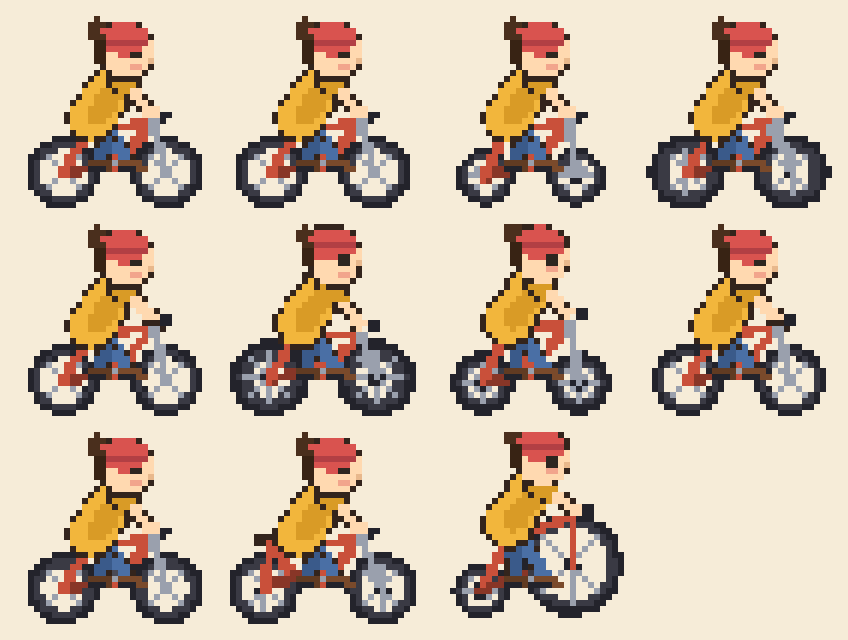
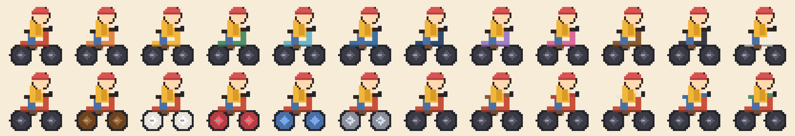
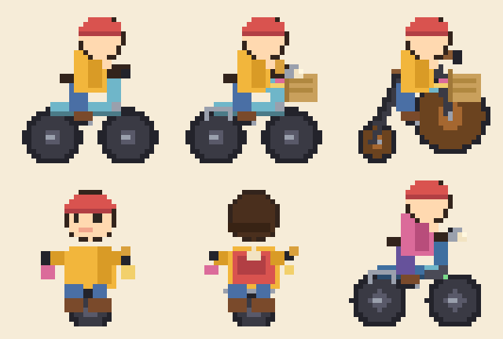
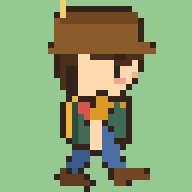
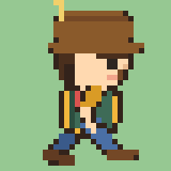
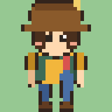
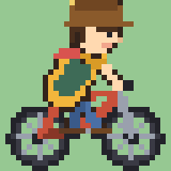
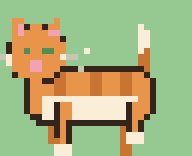

# 🍕 Pizza and Bird : 피자와 새 🐦

> 피자를 굽고, 자전거를 타고, 새를 찍는 — **완전 오프라인 픽셀 힐링 게임**
>
> 한국의 실제 지역을 배경으로, 화덕에서 피자를 구워 배낭에 챙겨 넣고
> 자전거로 터널을 넘어 전국을 돌아다니며 새 사진을 찍어 도감을 채우는 게임입니다.

  

---

## 🎮 게임 소개

| | |
|---|---|
| **장르** | 힐링 / 수집 / 라이팅 |
| **그래픽** | 코드 생성 순수 픽셀 아트 (**세로 540 가상 좌표 + 최대 2K 슈퍼샘플 렌더**, 32px 정밀 타일, 오토타일 도로, 새 13종 체형, **관절 기반 캐릭터 애니메이션**, 풀잎 개별 애니메이션) |
| **플랫폼** | Android 7.0 (API 24) 이상 |
| **네트워크** | ❌ 없음 — 완전 오프라인, 권한 0개 |

### 핵심 루프

1. 🏠 **집에서 피자 굽기** — 피자는 **화덕피자 🔥 / 일반 피자 🍕 두 계열, 총 12종**! 장작 **화덕**에서는 마르게리타·마리나라·콰트로 포르마지·고르곤졸라·디아볼라·루꼴라 프로슈토(얇은 도우, 커서가 빠르고 금방 타지만 효과가 큼)를, 옆의 **가정용 오븐**에서는 치즈·버섯·불고기·페퍼로니·고구마·콤비네이션(도톰하고 든든, 굽기 쉬움)을 타이밍 미니게임으로 굽는다 (걸작 → 맛있는 → 살짝 탐)
2. 🚲 **자전거 여행** — 포켓몬처럼 자전거를 타고 터널을 넘어 다른 지역으로! (텔레포트 없음) **탈것은 자전거뿐**, 모델 11종에 도색·부속품 커스텀까지!
3. 🏃 **달리기** — Shift(🏃 버튼)를 누르면 걷기보다 빠르게! (배고픔은 빨리 든다)
4. 📷 **탐조** — 필드에 나타난 새를 **프로 카메라 뷰파인더**로 조준해 촬영! AF 박스·거리 게이지·사거리 링으로 구도를 잡고, 셔터가 닫히면 **폴라로이드 인화**로 결과가 나온다. 거리뿐 아니라 **센서·초점거리·조리개·AF·손떨림 보정 등 장비 성능**이 그대로 별점을 가른다
5. 🌙 **낮과 밤** — 5분이 하루. 해가 지면 세상이 물들고 **올빼미·부엉이·해오라기 같은 밤새**가 나온다. 가로등과 창문이 은은하게 빛난다
6. 👨‍🔬 **보리 박사의 의뢰** — 부탁받은 새를 찍으면 보수 ₩ 획득 (3★면 보너스!)
7. 📚 **도감 채우기** — 한국조류학회 공식 목록 598종의 촬영 횟수·최고 별점이 기록되는 도감
8. 🐈 **골목 고양이** — 쓰다듬으면 행운 +1. 벤치에서 쉬면 행운 +2
9. 🧺 **집 꾸미기** — 사진용품점 장식 코너에서 소품을 사서 3개의 장식 칸에 배치 (행운 보너스)
10. 📷 **카메라 장비 시스템** — 일체형 컴팩트(보급~하이엔드)와 **바디 + 렌즈를 따로 사서 조립하는 렌즈교환식**. 센서·초점거리·조리개·AF·손떨림 보정이 실제 판정에 반영된다
11. 🍕 **피자 먹기** — 🍕 버튼 한 번으로 간식 타임 (배고픔 회복 + 행운 상승). 메뉴의 피자 탭은 화덕피자/일반 피자 탭으로 나뉘어 종류별 아이콘·재고·효과를 보여준다
12. ☘️ **행운 수치** — 높을수록 희귀한 새(팔색조, 두루미!)가 더 자주 출현
13. 📦 **이사 & 집 매입** — 서울에서 시작해 방문한 지역의 집을 실제 원화로 매입하고 이사할 수 있음
14. 🏠 **인테리어 4종** — 아늑한 집·서울 한옥·모던 스튜디오·초록 정원형을 구매/적용 (이사 후에도 유지)
15. 💴 **현실적인 원화 경제** — 보수·카메라 장비·장식·이사비·집값을 모두 대한민국 원(₩)으로 표시
16. 🎖️ **탐조가 성장** — 새를 찍고 의뢰를 완료하면 **경험치**를 얻어 **레벨(최대 25)** 이 오른다. 레벨업마다 **숙련 포인트(SP)** 를 받아 능력을 강화하고, 레벨 구간마다 **칭호와 겉모습(탐조 장비)** 이 바뀐다
17. 🚲 **자전거 상점** — 사진용품점에서 자전거 **모델 11종**을 사고팔고, **프레임·바퀴·안장 도색**(12/6/6색)과 **부속품 5종**으로 취향껏 꾸며요. 탈것은 자전거뿐!
18. 📖 **메인 스토리** — 보리 박사와 할머니의 낡은 수첩을 이어 쓰는 8장 구성. Lv.25에서 완결되며, 무작위 사진 의뢰는 메인과 독립적으로 언제든 수행/포기할 수 있다
19. 🏅 **라이퍼 등급 & 도장 깨기** — 598종 도감을 기준으로 입문~종새꾼 이정표와 딱다구리 3종, 여름 숲의 세 보석, 두루미·수리·도요 등 15개 컬렉션을 추적한다
20. 🌦 **날씨** — 1~2분마다 맑음·흐림·비·강풍·눈으로 바뀌며 새 출현에 영향. 비 오면 빗줄기와 물웅덩이, 눈 오면 풀밭과 지붕에 눈이 쌓이고 발자국이 남는다

21. 🎥 **몰입 카메라** — 걸으면 화면이 출렁이고, 달리면 시야가 넓어지며 잔상이 남고, 셔터를 누르면 세상이 아주 잠깐 멈춘다 (아래 참고)

### 🎥 몰입 카메라 — 화면이 "살아 있게"

탑다운 2D에서도 **그 자리에 서 있는 느낌**이 나도록, 카메라를 캐릭터처럼 움직인다. (`ViewRig.kt`)

| 기법 | 게임에서 느껴지는 것 |
|---|---|
| **① 카메라 셰이크** | 셔터, 자전거 충돌, 새 무리가 푸드덕 날아오를 때, 레벨업, 터널 진입 — 충격이 화면으로 전해진다 |
| **② 헤드 밥 & 바디 스웨이** | 걸음마다 위아래로 출렁이고 몸이 좌우로 기운다. 걷기·달리기·자전거의 리듬이 모두 다르다 (자전거는 노면 진동까지) |
| **③ 모션 블러 & 동적 FOV** | 빠를수록 잔상이 남고 속도선이 흐르며 시야가 넓어진다 (2D에 맞춰 줌아웃 + 잔상으로 치환) |
| **④ 카메라 딜레이 · 예측 배치** | 칼같이 따라붙지 않고 살짝 늦게 이징으로 따라오며, **진행 방향 앞쪽**을 더 보여준다 |
| **⑤ 다이내믹 포커싱(심도)** | 카메라 모드에서 가장 가까운 새를 자동으로 붙잡고, 초점 밖을 어둡게 눌러 시선을 모은다 |

- 그 밖에 **히트스톱**(셔터 순간 0.09초 정지), **플래시**, 결과창 지연(날아오르는 새를 먼저 보여준다), 발소리에 맞춘 발먼지.
- 🚑 **멀미 대응이 기본**: 설정 › 화면 연출에서 6가지를 각각 끌 수 있고, 흔들림은 **끔/약하게/보통/강하게** 4단계.
  바꾸는 즉시 미리보기 흔들림이 재생된다. HUD는 절대 흔들리지 않는다.
- 🔬 브라우저에서 바로 만져 보려면 **`tools/camera_lab/index.html`** — 게임과 같은 수식의 실험실이다.

### 📖 메인 퀘스트 — 함께 사는 지도

보리 박사가 건넨 할머니의 낡은 탐조 수첩에는 “새를 안다는 건 함께 살 방법을 배우는 일”이라는 문장이 남아 있습니다. 동네 새에서 시작해 숲의 두드림, 습지의 물길, 철새의 이동, 갯벌과 서식지 보호로 이어지는 8개 장을 완성합니다.

- 메인 퀘스트는 **레벨 25(만렙)** 에서 이야기가 완결되고 더 진행되지 않습니다.
- 보리 박사의 **사진 의뢰는 독립된 서브 퀘스트**입니다. 메인을 미루거나 끝낸 뒤에도 지역마다 언제든 받고 포기할 수 있으며 시간 제한이 없습니다.
- 주민·꼬마·할머니의 대사도 진행 장에 맞춰 관찰 거리, 둥지 보호, 희귀종 위치 공유 예절을 알려 줍니다.
- 메뉴의 **퀘스트** 탭에서 현재 목표, 라이퍼 등급, 컬렉션의 남은 새를 확인합니다.

### 🏅 라이퍼 기준과 컬렉션

실제 탐조에는 공인된 실력 등급이 없으므로 게임에서는 경쟁 자격이 아닌 **수집 이정표**로 표시합니다: 입문 0~29종 · 초보 30~99종 · 중수 100~199종 · 고수 200~299종 · 초고수 300~399종 · 종새꾼 400종 이상.

표준 종명은 한국조류학회 2025 v2.1을 따릅니다. 예를 들어 공식 표기는 `딱다구리`이며, 청도요는 물총새류가 아닌 도요류라서 물총새과 세트는 **물총새·호반새·청호반새·뿔호반새**로 구성했습니다. 딱다구리 기본 3종, 상급 5종, 박새 네 친구, 여름 숲의 세 보석, 겨울 오리·두루미·수리, 밤새, 도요, 보전종, 바다 원정 등 15개 세트가 있습니다.

### 📷 카메라 장비 시스템

현실의 카메라 규격을 그대로 게임 수치로 옮겼습니다. **게임은 물려받은 컴팩트 카메라(하늘광학 픽스 P1)로 시작**하고,
사진용품점 **진열대**에서 장비를 사서 **장비 가방**에서 조립합니다.

**두 가지 계통**

| 계통 | 특징 |
|---|---|
| 📷 **컴팩트(일체형)** | 렌즈 교체 불가. 가볍고 값이 싸다. **보급 / 중급 / 하이엔드** 11종 (포켓 줌·슈퍼줌·방수·1인치·프리미엄 단렌즈·네오 일안…) |
| 🔭 **렌즈교환식(ILC)** | **바디 10종 + 렌즈 19종 + 텔레컨버터 2종**을 마운트가 맞을 때 조립. 조합에 따라 성능이 완전히 달라진다 |

**실제로 계산에 쓰이는 현실 스펙**

- **센서 크기** `1/2.3" · 1/1.7" · 1" · M4/3 · APS-C · 풀프레임 · 중형` — 클수록 화질·고감도 ↑, 대신 무겁고 비싸다
- **35mm 환산 초점거리** — `환산 = 렌즈 초점거리 × 바디 크롭 배율 × 텔레컨버터 배율`. 환산 mm가 길수록 **촬영 반경**(최대 3.2 ~ 13칸)이 늘어난다
- **최단 촬영 거리** — 초망원은 너무 가까우면 화각에 안 들어온다 (접사 렌즈는 예외)
- **조리개(F값)** — 밝은 렌즈일수록 어두운 새벽/밤/비에서 노이즈 감점을 덜 받는다
- **화소(MP)와 렌즈 해상력** — 별 한 개를 더 받을 확률(화질 보너스)로 이어진다
- **AF 성능 · 연사(fps)** — 깡충대는 새는 초점을 놓칠 수 있고, **연사가 빠르면 한 번 더 기회**가 온다
- **손떨림 보정(IBIS + OS)** — 걸으면서/자전거로 찍으면 흔들림 감점. 보정이 좋으면 버틴다
- **방진방적** — 비·눈에서 렌즈에 물방울이 맺히는 감점을 막아 준다
- **무게** — 총 무게가 무거울수록 **이동 속도 ↓ · 배고픔 ↑** (속사 스트랩으로 20% 완화)
- **마운트** — `HB-E(미러리스) / HB-F(DSLR) / M4/3 / MF-G(중형)`. **마운트 어댑터**를 사면 F 렌즈를 E 바디에 (AF는 조금 손해)
- **크롭 모드** — APS-C 전용 렌즈를 풀프레임 바디에 물리면 화소가 깎이는 대신 환산 초점거리가 늘어난다

**액세서리 5종** — 속사 스트랩 / 레인 커버 / 마운트 어댑터 / 카본 삼각대+짐벌 / 위장 블라인드 텐트(새 도주 반경 −18%, 행운 +2)

**브랜드** — 하늘광학 · 한빛이미징 · 솔개옵틱 · 까치광학 · 루멘 · 참새정밀 · 오리온

> 장비는 **아이콘(정면)과 진열용 측면 그림**이 코드로 자동 생성되고, **플레이어가 실제로 카메라를 목에 걸고 다니며**
> 카메라 모드에서는 눈높이로 들어 올립니다. 경통 길이·지름·후드·흰 망원렌즈까지 장비에 따라 그림이 달라져요.

### 🎖️ 탐조가 레벨 & 능력 (성장 시스템)

- **경험치**: 새 촬영(등급×별점) · 첫 발견 보너스 · 박사 의뢰 완료로 획득
- **칭호**: 새내기 탐조인 → 초보 → 어엿한 → 능숙한 → 숙련 → 베테랑 → 명인 → **전설의 탐조가**
- **겉모습 진화**: 레벨이 오르면 탐조 캡 → 조끼 → 챙 넓은 모자·목도리·깃털로 장비가 좋아진다
- **숙련 포인트로 강화하는 능력 6종** (메뉴 › **성장** 탭):

| 능력 | 효과 |
|---|---|
| 🦵 튼튼한 다리 | 이동 속도 ↑ (최대 4랭크) |
| 🎒 넉넉한 배낭 | 피자 소지 한도 ↑ |
| 🤫 고요한 발걸음 | 새가 덜 놀람(더 가까이) |
| 🍙 튼튼한 체력 | 배고픔 감소 ↓ |
| 🍀 타고난 행운 | 행운 감소 ↓ · 하한 ↑ |
| 👁️ 매의 눈 | 사진 별 추가 확률 ↑ |

> SP는 레벨업(5레벨마다 보너스)으로 얻거나, 사진용품점 감각의 **탐조 강습**(성장 탭에서 돈으로 구매)으로도 얻을 수 있어요.

### 🚲 자전거 — 탈것은 자전거뿐!

자동차도 스쿠터도 없습니다. 오직 자전거로 전국을 여행해요! 사진용품점의 **자전거 상점**에서 모델을 사고, 도색·부속품으로 취향껏 꾸며요.



| 모델 | 가격 | 효과 (기본 자전거 대비) | 특징 |
|---|---|---|---|
| 🚲 오래된 기본 자전거 | ₩0 | — | 모든 여행의 시작이에요 |
| 🚲 클래식 시티 바이크 | ₩120,000 | 속도 +6% · 배고픔 -5% · 새 놀람 -4% | 편안한 자세로 오래 탈 수 있음 |
| 🚲 미니벨로 | ₩260,000 | 속도 +10% · 배고픔 -8% · 새 놀람 -8% | 작고 가벼운 바퀴 |
| 🚵 산악 자전거 MTB | ₩420,000 | 속도 +14% · 배고픔 +2% · 새 놀람 +5% | 두꺼운 타이어, 비포장 길 OK |
| 🤸 BMX 스트리트 | ₩340,000 | 속도 +12% · 배고픔 +6% · 새 놀람 +8% | 작고 단단한 프레임 |
| 🌴 비치 크루저 | ₩560,000 | 속도 -2% · 배고픔 -22% · 새 놀람 -12% · **행운 +1** | 푹신한 안장, 통통한 바퀴 |
| ⚙ 픽시 (고정기어) | ₩620,000 | 속도 +20% · 배고픔 +8% · 새 놀람 +7% | 간결한 프레임, 조용한 체인 |
| 🚴 로드 레이서 | ₩780,000 | 속도 +28% · 배고픔 +18% · 새 놀람 +12% | 최고 속도! 대신 새가 놀람 |
| 💞 탠덤 자전거 | ₩1,500,000 | 속도 +8% · 배고픔 +12% · 새 놀람 +1% · **행운 +2** | 두 사람이 타는 자전거 |
| 🔋 전기 자전거 | ₩2,400,000 | 속도 +42% · 배고픔 -30% · 새 놀람 -15% | 전기 모터가 페달을 도와줌 |
| 🎩 빈티지 하이휠 | ₩3,200,000 | 속도 -4% · 배고픔 +5% · 새 놀람 -7% · **행운 +3** | 앞바퀴가 커다란 전설의 모델 |

**🎨 도색 커스텀** — 프레임 12색 · 바퀴 6색 · 안장·그립 6색, 언제든 **무료**로 바꿔요



**🔧 부속품** — 구매하면 바로 장착돼요

| 부속품 | 가격 | 효과 |
|---|---|---|
| 🧺 라탄 바구니 | ₩40,000 | 피자 소지 +1 |
| 📦 뒷바퀴 짐받이 | ₩45,000 | 피자 소지 +1 |
| 🔦 전조등 | ₩60,000 | 새 놀람 -15% |
| 🎀 바람개비 스트리머 | ₩25,000 | 행운 +1 |
| 🔔 예쁜 방울 | ₩35,000 | 행운 +1 |



### 지역 (실제 한국 32곳)

첫 시작 집은 **서울로 고정**됩니다. 서울에서 출발해 터널로 여행하고, 방문한 지역의 집을 매입하면 그곳으로 이사할 수 있어요.

**도시 · 마을 12곳**
서울 · 인천 · 춘천 · 강릉 · 속초 · 대전 · 전주 · 대구 · 광주 · 울산 · 부산 · 제주
(부산 ↔ 제주는 **해저 터널**로 연결!)

**대한민국 대표 탐조지 20선** 🕊
| 지역 | 한마디 | 추천 시기 |
|---|---|---|
| 강화도 갯벌 | 저어새 번식지, 세계적 갯벌 | 4~9월 |
| 철원 평야 | 두루미·재두루미 월동지 | 11~2월 |
| 낙동강 하구(을숙도) | 최대 철새도래지, 오리·고니 | 11~3월 |
| 공릉천 | 하천 습지의 철새와 텃새 | 가을·겨울 |
| 광릉숲(국립수목원) | 500년 숲의 숲새들 | 4~6월 |
| 송도 갯벌·시흥 갯골 | 도심 옆 저어새·도요물떼새 | 봄·가을 |
| 시화호 | 되살아난 호수의 큰고니 | 11~2월 |
| 화성 습지·화성호 | 도요새의 국제 휴게소 | 4~5월, 8~10월 |
| 안산 갈대습지 | 산책하며 만나는 첫 탐조지 | 사계절 |
| 매향리 해안 | 도요물떼새 해양 탐조 명소 | 봄·가을 |
| 주남저수지 | 가마우지·기러기·고니 | 11~2월 |
| 순천만 습지 | 흑두루미와 갈대밭 | 11~2월 |
| 금강 하구(군산·서천) | 가창오리 군무 | 12~2월 |
| 고창 갯벌 | 저어새·검은머리물떼새 | 봄·가을 |
| 태안 천수만(안면도·간월호) | 기러기떼와 맹금류 | 10~2월 |
| 우포늪(창녕) | 최대 내륙습지, 따오기 | 사계절 |
| 제주 하도리 | 철새들의 낙원 | 11~3월 |
| 한라산 국립공원 | 동박새·어치 등 산림 텃새 | 겨울·봄 |
| 파주 임진강·DMZ | 두루미와 맹금류의 청정지대 | 11~2월 |
| 왕피천(울진) | 연어를 노리는 물수리 | 가을 |

### 🗺 전국 지도
실제 경위도로 그린 **한반도 모양 벡터 지도**. 두 손가락으로 **확대/축소**, 끌어서 이동,
지역을 누르면 서식지·대표 새·추천 시기·탐조 팁·연결 정보가 나옵니다.
(해안선·섬·주요 하천·백두대간 봉우리·휴전선까지 표시)

### 🕺 캐릭터 동작 (관절 애니메이션)

캐릭터 스프라이트는 프레임을 손으로 찍어 만든 그림이 아니라 **관절 각도(포즈)를 계산해서 매번 그려 낸** 것입니다.
엉덩이·무릎·발목·어깨·팔꿈치·손목·목까지 따로 움직이기 때문에 **손 · 발 · 머리의 아주 작은 움직임**까지 살아 있습니다.

| 동작 | 무엇이 움직이나 |
|---|---|
| 🧍 **서 있기** | 숨쉬기(가슴·어깨 오르내림) · 무게중심 좌우 이동 · **눈 깜빡임** · 가끔 두리번거리기 · 머리카락/배낭 흔들림 |
| 🚶 **걷기** | 팔다리 교차 스윙 · 무릎 굽힘 · **발뒤꿈치→발끝 굴림** · 상하 바운스 · 고개 끄덕임 · 앞머리·목도리 찰랑 |
| 🏃 **달리기** | 큰 보폭 · 굽힌 팔 · 앞으로 기운 상체 · 공중에 뜨는 순간 · 입을 벌린 거친 숨 · **발 닿을 때 먼지** |
| 🤫 **살금살금** | 카메라 모드 이동 시 — 웅크린 자세 · 좁은 보폭 · 팔을 몸에 붙임 |
| 📷 **조준** | 두 손으로 카메라를 눈높이로 · 숨죽인 미세한 흔들림 · 셔터 순간 플래시 |
| 🚲 **자전거** | **2관절 IK로 페달을 실제로 밟는 다리** · 돌아가는 바퀴살 · 핸들 기울임 · 몸통 바운스 |
| 🎉 **레벨업** | 폴짝폴짝 뛰며 만세 (레벨업 팝업) |

걷기 ↔ 달리기 ↔ 살금살금은 **위상(phase)을 이어받아** 전환되고, 재생 속도가 실제 이동 속도에 비례해서
발이 땅에서 미끄러지지 않습니다. 그림자도 동작에 맞춰 같이 호흡해요.

NPC도 성격대로 움직입니다 — **보리 박사**는 고개를 끄덕이다 안경을 고쳐 쓰고, **사진용품점 주인**은 손을 흔들고,
**동네 주민**은 두리번거리고, **꼬마**는 제자리에서 통통 뛰고, **할머니**는 지팡이를 짚고 천천히 흔들립니다.
골목 **고양이**는 앉아서 꼬리를 살랑이며 귀를 쫑긋하고 눈을 깜빡이다가, 걸을 때는 네 다리가 교차합니다.


| 걷기 | 달리기 | 서 있기 | 자전거 | 고양이 |
|---|---|---|---|---|
|  |  |  |  |  |

> 위 이미지는 `python3 tools/preview/render_people.py docs/img` 로 언제든 다시 만들 수 있습니다
> (게임과 같은 알고리즘을 옮겨 놓은 파이썬 미리보기 — `tools/preview/people.py`).

### 새 (공식 목록 598종)

한국조류학회 2025 v2.1 목록 598종이 출현하며, 아래 39종은 지역·설명·팔레트를 별도로 다듬은 대표 새입니다.

참새·직박구리·까치·박새·멧비둘기·어치·괭이갈매기 (흔함) /
쇠제비갈매기·청둥오리·쇠오리·중대백로·까막딱따구리·청딱따구리·뻐꾸기·검은댕기해오라기·올빼미 (보통) /
황조롱이·말똥가리·참매·물총새·팔색조·원앙·수리부엉이·재두루미 (희귀) /
두루미·황새·흑두루미·흰꼬리수리·따오기 (전설)

추가 탐조지 새: 민물가마우지·개개비·동박새 (흔함) / 큰기러기·검은머리물떼새·붉은어깨도요 (보통) /
가창오리·큰고니·저어새·물수리 (희귀)

새 아트는 **명금·오리·백로·맹금·올빼미·도요·바닷새·딱다구리·비둘기·물총새·팔색조·꿩·제비형의 13개 실루엣**과 9개 깃무늬를 조합합니다. 종별 머리색과 포인트 컬러가 적용되고, 도망칠 때는 날개를 위아래로 펄럭이는 전용 비행 프레임이 표시됩니다.

---

## 🛠️ 빌드 방법

### Android Studio
1. 이 저장소를 Clone 후 Android Studio로 열기
2. Sync → Run ▶

### 커맨드라인
```bash
./gradlew assembleDebug     # debug APK
./gradlew assembleRelease   # release APK (시크릿 없으면 debug 키로 서명)
```
APK 위치: `app/build/outputs/apk/`

요구 사항: JDK 17, Android SDK (API 35)

---

## 📦 GitHub Actions로 베타 APK 받기 (CI)

이 저장소는 **push할 때마다 APK를 자동 빌드**합니다.

1. GitHub 저장소 → **Actions** 탭 → `Android APK Build` 워크플로우 확인
2. 빌드가 끝나면 해당 실행(run) 페이지 하단 **Artifacts**에서 APK 다운로드
   - `pizza-and-bird-debug-apk` — 디버그 APK (베타 테스트용 추천)
   - `pizza-and-bird-release-apk` — 릴리스 APK
3. **정식 릴리스 배포**: `v*` 태그를 push하면 GitHub Release에 APK가 첨부됩니다
   ```bash
   git tag v0.2.0 && git push origin v0.2.0
   ```
4. (권장) 스토어 출시 전 시크릿에 키스토어 등록 → 워크플로우 파일 상단 주석 참고

> 베타 테스트 배포가 목적이라면 debug APK을 그냥 나눠주면 됩니다.
> 설치 시 "출처를 알 수 없는 앱" 허용이 필요할 수 있어요.

---

## 📷 새를 찍는 화면

### 뷰파인더 (카메라 모드)


카메라 모드에 들어가면 HUD가 물러나고 화면 전체가 **뷰파인더**가 됩니다.

- **프레임** — 모서리 브래킷(흰색 + 금색 포인트), 3분할 그리드, 좌우 조리개 눈금, 중앙 십자
- **비네트 + 필름 그레인** — 네 변이 부드럽게 어두워지고 미세한 필름 노이즈가 흐릅니다
- **상단 바** — 빨간 ● PHOTO 표시등(깜빡임), 시각(해/달 아이콘), 지금 쓰는 장비와 사거리
- **하단 바** — ISO·조리개·쉐터 값(장비 등급에 따라 변함), 도감 현황, **거리 게이지**(★3 초록 / ★2 노랑 / ★1 빨강)
- **AF 박스** — 조준 중인 새에 초점 브래킷이 붙고 **이름 · 예상 별점 · 거리(칸)** 를 보여줍니다 (아직 못 찍은 새는 `??? 미확인`)
- **사거리 링** — 카메라 등급별 촬영 반경(점선이 천천히 흐름)과 ★3/★2 경계 링
- **AF 획득 연출** — 조준 대상이 바뀌면 바깥에서 안으로 좁혀오는 링이 번쩍

### 촬영

- 탭하는 순간 위·아래 **셔터 블레이드**가 닫히고 날 끝에 빛이 번지며 **"찰칵!"** → 화이트 플래시
- 촬영 중에는 시간이 35%로 느려지고, 내 이동속도 50%, 새의 경계 범위 40% 감소
- 촬영 판정은 AF 박스를 살짝 빗나가게 탭해도 잡히도록 넉넉합니다

### 결과 — 폴라로이드 인화

- 결과 카드는 살짝 기울어진 **인화지**로 나옵니다 (이중 그림자 + 이름/등급 캡션 + NEW 첫 발견 스티커)
- 사진 속 풍경은 **서식지(바다·물·습지·숲·산·도시)와 낮/밤**에 따라 달라집니다 (하늘 그라데이션·구름·별·해/달·언덕·물결)
- 별점은 좌→우로 하나씩 튀어나오고, 하단에 카메라·거리·시각·누적 촬영 횟수가 함께 인쇄됩니다
- 화면을 탭하면 셔터가 다시 열리며 탐조가 이어집니다

> 프리뷰 이미지는 `tools/preview_viewfinder.py` 로 생성합니다 (게임 코드와 동일한 좌표를 Python으로 옮겨 그린 것).

---

## 🕹️ 조작법 — 듀랑고(Wild Lands) 스타일

넥슨의 **야생의 땅: 듀랑고**와 동일한 구조의 터치 조작입니다.

| 입력 | 동작 |
|---|---|
| 좌하단 **플로팅 조이스틱** | 화면 왼쪽 아래를 짚은 **그 자리가 조이스틱** (손을 떼면 스프링처럼 원위치). **v0.4.1 디자인**: 유리 베이스+금속 림+3D 캡+게이지 호. 살짝만 밀면 살금살금(아날로그), 움직임 없이 떼면 월드 탭으로 동작. WASD/화살표도 가능 |
| 우하단 **육각 메인 버튼** | 상호작용 / Z·Space. 근처 대상에 따라 아이콘이 바뀝니다 (💬주민 · 🪧이정표 · ☕벤치 · 🐈고양이 · 🚪집 · 🔥화덕 · 🍕오븐 · 🛏침대 · 📦이사박스 · 🎨인테리어 · 🪴장식칸) |
| 육각 버튼 부채꼴 **🚲** / X | 자전거 타기/내리기 |
| 육각 버튼 부채꼴 **📷** / C | 카메라 모드 — 뷰파인더로 조준, 새를 탭하면 셔터가 닫히며 촬영 (시간이 느려지고, 다시 누르면 나가기) |
| 육각 버튼 부채꼴 **»** / Shift | 달리기 (홀드, 걸을 때만) |
| 육각 버튼 부채꼴 **🍕** / E | 간식 먹기 (제일 좋은 피자를 얼른! 개수 뱃지 표시) |
| 좌하단 구석 **≡** / M | 메뉴 (상태 / 퀘스트 / 성장 / 피자 / 도감 / **설정 → 🕹️ 조이스틱**: 움직이는 스틱·민 만큼 속도 전환) |
| 우측 상단 **황동 나침반** | 탭하면 큰 지도 (아래 메모지도 가능) |
| 월드 탭 | NPC·이정표·새·화덕 등을 직접 탭해서 상호작용 (새는 카메라 모드에서 촬영) |
| 키보드 | WASD/화살표 이동, Z=상호작용, X=자전거, C=카메라, M=메뉴, E=간식, Shift=달리기 |

---

## 🗂️ 프로젝트 구조

```
app/src/main/java/com/pizzaandbird/game/
├── MainActivity.kt      액티비티 (몰입 모드, 키 입력)
├── GameView.kt          SurfaceView 게임 루프 (60fps)
├── Game.kt              씬 관리, 가상 좌표 스케일링 + 2K 슈퍼샘플 월드 버퍼, 페이드 전환, 햅틱
├── Input.kt             멀티터치 D패드 + A/B/카메라/메뉴/달리기/간식 + 키보드
├── Assets.kt            픽셀 아트 코드 생성(새 13체형·깃무늬·비행·캐릭터 티어·도로 부속) + art/svg → VectorDrawable 87종 래스터
├── Assets.kt            모든 픽셀 아트를 코드로 생성 (이미지 파일 0개! 새 13체형·깃무늬·비행 프레임)
├── CharacterArt.kt      관절(골격) 기반 캐릭터 애니메이션 — 사람/자전거/고양이 포즈를 계산해 프레임 생성
├── Audio.kt             효과음(SoundPool) + BGM/환경음(MediaPlayer, 페이드 인·아웃) — res/raw의 sfx_*/amb_*/bgm_*
├── Data.kt              공식 조류 598종(대표 39종 큐레이션) / 지역 32곳(도시 12 + 탐조지 20) / 피자 12종(화덕·일반) / 장식
├── Cameras.kt           카메라 장비 시스템 — 센서·마운트·컴팩트 11 / 바디 10 / 렌즈 19 / TC 2 / 액세서리 5 + 조합 성능 계산
├── Quests.kt            메인 스토리 8장 / 라이퍼 등급 / 탐조 도장 깨기 15세트
├── BirdChecklist.kt     한국조류학회 2025 v2.1 공식 조류목록 598종
├── KoreaMap.kt          실제 경위도 기반 한반도 벡터 지도(해안선·섬·하천·산·DMZ)
├── GameState.kt         진행 상황 + 낮밤 시각 + 오프라인 저장 (JSON v4, v1~v3 세이브 마이그레이션)
├── Maps.kt              타일(31종), 3레이어 맵(지면/포장/데칼) + 도로망 절차 생성, 플레이어/새/고양이/NPC
├── Roads.kt             길 아트 — 오토타일 포장면(흙길/석재), 광장 문양, 접지 그림자
├── ViewRig.kt           화면 움직임 리그 (셰이크·헤드밥·동적 FOV·레이트 트래킹·심도·속도선)
├── Fx.kt                디테일 연출 — 날씨, 조명 맵, 물 깊이/윤슬, 발자국, 나비·잠자리·나방, 철새 그림자, 굴뚝 연기
├── Grass.kt             살아있는 풀 (뼈대 리그 + IDLE/SWAY/GUST/BEND/RECOVER 상태 머신 + 바람 필드)
├── Scenes.kt            씬 베이스 + 타이틀 화면
├── RegionSelect.kt      서울 고정 시작 / 집 매입·이사 지역 선택 UI
├── WorldScene.kt        월드 탐험 (자전거·달리기·터널·탐조·의뢰·낮밤·파티클·날씨 효과)
├── Viewfinder.kt        카메라 뷰파인더 (프레임·비네트·AF 박스·거리 게이지·셔터 연출)
├── HomeScene.kt         집 내부 (화덕=화덕피자·오븐=일반 피자·침대·인테리어 4종·이사·장식 3칸)
├── Hud.kt               스탯 바(배고픔/행운/돈/시각·날씨·레벨) + 황동 나침반 미니맵 + 아날로그 조이스틱(v0.4.1 디자인)/육각·아크 버튼
└── Overlays.kt          대화상자 / 메뉴 6탭(피자 탭은 화덕·일반 서브탭) / 피자 굽기 3단계 / 카메라 상점·장비 가방 / 장식 상점 / 자전거 상점(모델·도색·부속품) / 폴라로이드 사진 결과 / 확대 가능한 전국 지도

tools/make_icons.py      런처 아이콘 생성 (순수 Python, 의존성 0)
tools/generate_bird_checklist.py  공식 조류목록 Kotlin 데이터 생성
tools/MapTest.kt         맵 로직 검증 스크립트 (144개 맵 조합 + 길 연결성 자동 테스트)
tools/preview/           미리보기 (길 디자인 · 캐릭터 애니메이션 시트/GIF — tools/preview/README.md)
tools/preview_viewfinder.py  뷰파인더/인화 프리뷰 이미지 생성 (게임 코드 영향 없음)
tools/joystick-preview/    조이스틱 디자인 인터랙티브 미리보기 (브라우저 BEFORE/AFTER, 게임 코드와 독립)
tools/preview_grass_live.py  살아있는 풀 프리뷰 (리그 포즈시트 + 돌풍 파동·밟힘 검증 이미지/GIF)
tools/camera_lab/        카메라 연출 실험실 (브라우저에서 같은 수식으로 즉시 튜닝·비교)
tools/typecheck.sh       안드로이드 SDK 없이 Kotlin 소스만 빠르게 타입체크 (개발 샌드박스용)
```

### 🔊 사운드

모든 오디오는 `app/src/main/res/raw/`에 정리되어 있습니다.

| 종류 | 파일 | 쓰이는 곳 |
|---|---|---|
| 🎵 BGM | `bgm_title.m4a` (신비로운 세계) | 타이틀·캐릭터/지역 선택 |
| 🎵 BGM | `bgm_world.m4a` (새가 날아가는 길) | 월드 탐험 |
| 🎵 BGM | `bgm_home.m4a` (집의 잔잔함) | 집에 들어왔을 때 |
| 🌿 환경음 | `amb_birds` / `amb_hum` / `amb_wind` / `amb_fire` | 낮 필드 / 숲 지역 낮 / 밤 / 피자 굽기 |
| 🔔 효과음 | `sfx_*` 19종 | 촬영·도망·지저귐·별점·도감 신규·굽기 결과·간식·자전거·터널·구매·보수·실패·알림·부엉이·발소리(자갈 걷기/달리기·나무) 등 |

- 곡 배치를 바꾸려면 각 씬의 `playBgm(R.raw.bgm_*)` 호출만 수정하면 됩니다 (`Scenes.kt`/`WorldScene.kt`/`HomeScene.kt`)
- 효과음 이벤트 매핑은 `Audio.kt`의 `Sfx` enum 주석 참고
- 메뉴(☰) → 설정에서 음악/효과음을 각각 켜고 끌 수 있고, 설정은 세이브에 저장됩니다

### 콘텐츠 추가 방법
- **새 목록 갱신**: `한반도_조류_전체목록_2025.txt` 갱신 후 `python3 tools/generate_bird_checklist.py` 실행 → `Birds.ALL`/도감/스폰/박사 의뢰에 자동 반영 (`active = "night"`로 밤새 지정 가능)
- **지역 추가**: `Regions.ALL` + `LINKS`에 연결 추가 → 맵은 절차 생성 (지역당 각 방향 최대 1개 터널)
- **피자 종류**: `Pizzas.ALL`에 `PizzaDef`를 추가 (`kind`로 화덕피자/일반 피자 지정, id는 세이브 인덱스이므로 **끝에만 추가**). 아이콘은 바탕색·토핑색 2가지만 적으면 계열별 템플릿으로 자동 생성
- **장식 소품**: `Decors.ALL`에 추가 (아트는 자동 생성은 아니고 `Assets.buildDecorArt`에 추가)
- **카메라 장비**: `Cameras.kt`의 `CameraGear.COMPACTS / BODIES / LENSES / TELECONVS / ACCESSORIES`에 항목 추가 → 상점·장비 가방·아이콘·인게임 스프라이트에 자동 반영 (`CamLook`으로 생김새 지정)
- **집 인테리어**: `HouseStyles.ALL`에 스타일과 원화 가격을 추가 → 집 안 인테리어 보드에서 구매/적용
- **아트 파이프라인 (NPC/고양이/타일/아이콘/데코)**: `art/svg/*.svg` (64px 그리드, `<symbol id="art_*">`) — `python3 tools/build_art.py` 로 VectorDrawable 생성, `python3 tools/svg_preview.py --zoom 5` 로 미리보기, `python3 tools/bird_preview.py` 로 새 치환 검증

---

## 🗺️ 로드맵

- [x] v0.1.0 — 환경 구축: 코어 루프 + 한국 9개 지역 + 새 12종 + 피자/화덕 + 카메라 업그레이드 + 이사 + 도감 + CI APK 빌드
- [x] v0.2.0 — 디테일 대업그레이드: **960×540 고해상도 + 32px 타일**, 지역 12곳(전주·대구·울산), 새 26종(밤새 3종), **낮/밤 순환**, 피자 토핑 3종, 집 장식 6종, 달리기, 간식 버튼, 고양이·벤치·이정표·가로등, 지역별 날씨 파티클(낙엽/꽃잎/눈/반딧불), 클라우드 섀도, 탭 편의 조작
- [x] 공식 새 목록 업데이트 (한국조류학회 2025 v2.1 598종, 아종 383개)
- [x] v0.2.1 — 새 디자인 업그레이드(13종 체형·9종 깃무늬·종별 머리/포인트색·도주 비행 2프레임·서식지 사진 결과 카드) + **치명 버그 수정**(오버레이 닫힘, 대화 선택지 자동 닫힘, 키 반복 입력 방지, 희귀새·의뢰새 출현 알림)
- [x] v0.3.0 — **대한민국 대표 탐조지 20선 추가(총 32개 지역)**, 큐레이션 새 39종, 실제 지형 기반 **확대 가능한 한반도 지도**
- [x] 살아있는 풀 — 풀잎 뼈대 리그(5종 385포즈) + 바람 필드(돌풍이 화면을 가로지름) + IDLE/SWAY/GUST/BEND/RECOVER 상태 머신, 걸으면 밟혀 눕고 오버슛으로 회복
- [x] v0.3.0 — **탐조가 성장 시스템**: 레벨·경험치(최대 25레벨) + 칭호 + 레벨 구간별 겉모습(탐조 장비) 진화 + 숙련 포인트로 강화하는 능력 6종(속도·배낭·은신·체력·행운·별점) + 성장 메뉴 탭 + 돈으로 SP를 얻는 탐조 강습
- [x] v0.3.1 — **탐조 화면 대개편**: 프로 카메라 뷰파인더(프레임·비네트·필름 그레인·AF 박스·거리 게이지·사거리 링·AF 획득 연출), 셔터 블레이드 + 플래시 연출, **폴라로이드 인화 결과 카드**(서식지·낮밤별 사진 풍경)
- [x] v0.3.1 — **길 디자인 개편**: 오토타일 도로(흙길 바퀴자국·석재 판석·연석·길섶 풀), 팔각 광장과 나침반 문양,
      사행 간선도로·컬드삭·나팔목 진입, 건물 앞 샛길/호숫가 데크/숲속 쉼터, 가로수·가로등 도열, 접지 그림자
- [x] v0.3.1 — **초디테일 그래픽 대업그레이드**: 타일 리라이트(다층 노이즈·디더 그라데이션·베벨 하이라이트), 나무 4종(참나무/소나무/벚나무/단풍), 살아있는 물결·포말·별 반짝임, **방사형 그라데이션 가로등/창문 광원**, 비네트·따뜻한 새벽/노을 빛줄기, 부드러운 엔티티 그림자, 밤 반딧불 후광
- [x] 사운드 업데이트 — 🎵 BGM 3곡(Suno) + 효과음 19종 + 환경음 4종(낮/밤/숲/화덕 전환), 페이드 인·아웃 전환, 설정에서 음악·효과음 토글
- [x] v0.4.0 — **2K 렌더링 아키텍처**: 세로 540 가상 좌표 + 가로 화면비 적응(720~1280, 레터박스 제거),
      월드 **정수배 슈퍼샘플링(1~3×)** — FHD/2K=2× 네이티브급 · 4K=3×, 픽셀 아트 격자 유지.
      설정 › 화질(자동/1×/2×/3×)·화면 보간 옵션, 타이틀/캐릭터 선택 화면비 적응, 집 내부 16×12 확장, 울트라와이드(20:9) 검증
- [x] v0.3.2 — **게임 내부 디테일 업그레이드**: **날씨 연출**(비 — 빗줄기·땅 튀김·물웅덩이·젖은 발자국 / 눈 — 쌓이는 눈·눈 발자국 / 강풍 — 바람결·빠른 구름 그림자),
      부드러운 **조명 맵**(밤 가로등·창문·터널 등·반딧불·플레이어 주변), 시각에 따라 도는 **햇빛 그림자**, 물 깊이·윤슬·찰랑이는 물가,
      지형별 **발자국**(모래·눈·젖은 길)·바퀴 자국·풀잎/물 튀김, 풀숲이 발목을 덮는 효과, **나비·잠자리·나방·물고기 점프·철새 그림자**,
      우리 집 굴뚝 연기, NPC 이름표·말풍선 이모트, 잠자는 고양이, 집 안 창밖 풍경·햇살·먼지·벽시계·화덕 불티 + 인테리어 포인트 위치 버그 수정
- [x] v0.4.0 — **카메라 장비 개편**: 컴팩트(보급/중급/하이엔드) + 바디·렌즈 분리 구매·결합(마운트/어댑터/텔레컨버터),
      센서·초점거리·조리개·AF·연사·손떨림·방진방적·무게를 반영한 새 촬영 판정, 뷰파인더/폴라로이드에 **실제 장비값 EXIF**,
      **카메라 아이콘/측면 진열 그림/플레이어가 실제로 들고 다니는 카메라** 픽셀 아트
- [x] v0.3.3 — **피자 12종으로 확장 & 화덕피자/일반 피자 계열 분리**: 집에 가정용 오븐 추가(일반 피자), 화덕은 화덕피자 전용, 종류별 픽셀 아이콘, 메뉴 피자 탭 서브탭, 계열별 굽기 난이도(화덕은 빨리 타지만 효과 큼)
- [x] v0.4.1 — **조작 구조 개편(듀랑고식) + 조이스틱 디자인 업그레이드**: 좌하단 **플로팅 조이스틱**(짚은 자리가 스틱), 육각 메인 버튼(맥락 아이콘) + 부채꼴 아크 버튼(🚲·📷·»·🍕),
      유리 베이스+금속 림+눈금 32개, 3D 스틱 캡(피자 엠블럼·스페큘러·접촉 그림자), 게이지 호·방향 셰브론·달리기 링·앰버 글로우, 스프링 복귀,
      아날로그 이동(민 만큼 속도), 조이스틱 구역 탭 보존, 설정 탭 🕹️ 옵션 2종, 버튼 입체감 리프레시
- [x] 전반 폴리시 — 오버레이 등장 연출(페이드+정착) · 버튼 눌림 피드백 · UI 터치 사운드, 배너/토스트 페이드인과 HUD 겹침 해소(스탯·레벨·날씨·의뢰 칩),
      캐릭터 선택 화면 재작성(좌표 오류·성별 스프라이트 수정), 화면 전환 이징, 카메라 뷰파인더 열림/닫힘 애니메이션, 사진 결과 별점 팝 연출
- [x] v0.4.1 — **몰입 카메라(화면 움직임)**: 카메라 셰이크(4단계 · 멀미 대응) + 헤드 밥/바디 스웨이 + 잔상·속도선·동적 FOV +
      레이트 트래킹/예측 배치 + 다이내믹 포커싱(장착 렌즈의 조리개·초점거리 반영) + 셔터 히트스톱/플래시, 설정 6종 + 브라우저 실험실
- [ ] 계절별 출현/지역별 희귀도 세분화
- [ ] 계절 순환
- [ ] 사진 앨범 & 사진 평점 (돈 벌기)
- [ ] 사운드/음악
- [ ] 클라우드 없는 백업(내보내기 코드)
- [ ] 플레이스토어 출시

자세한 기획: [docs/DESIGN.md](docs/DESIGN.md)

---

## 📄 라이선스

아직 미정 (출시 전 결정 예정)
