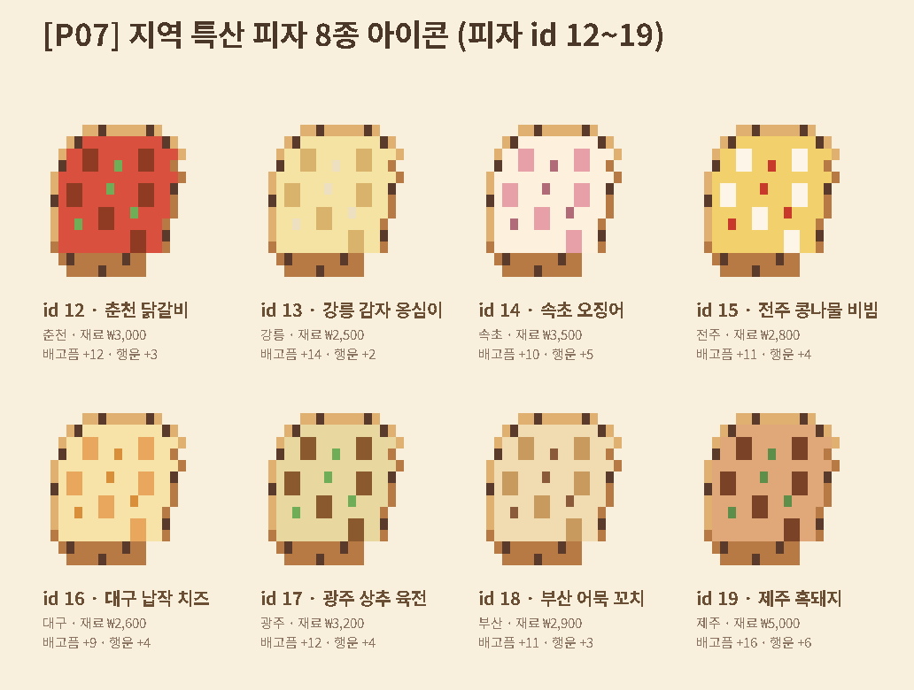
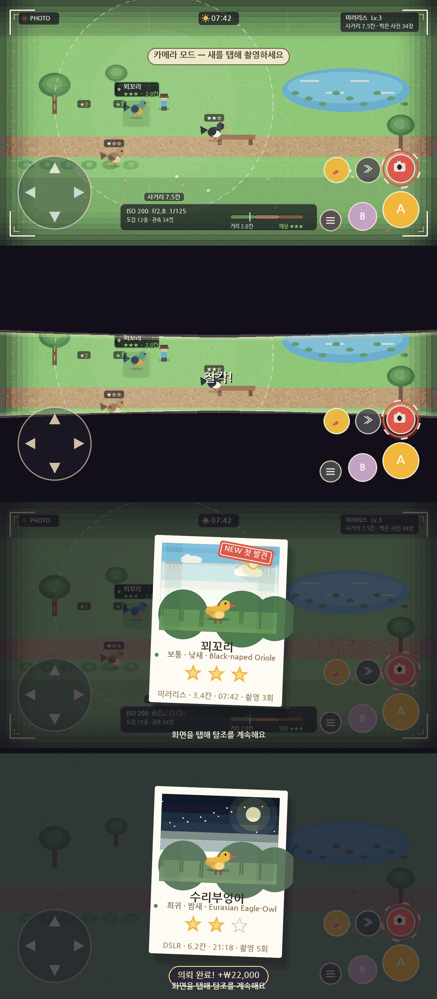
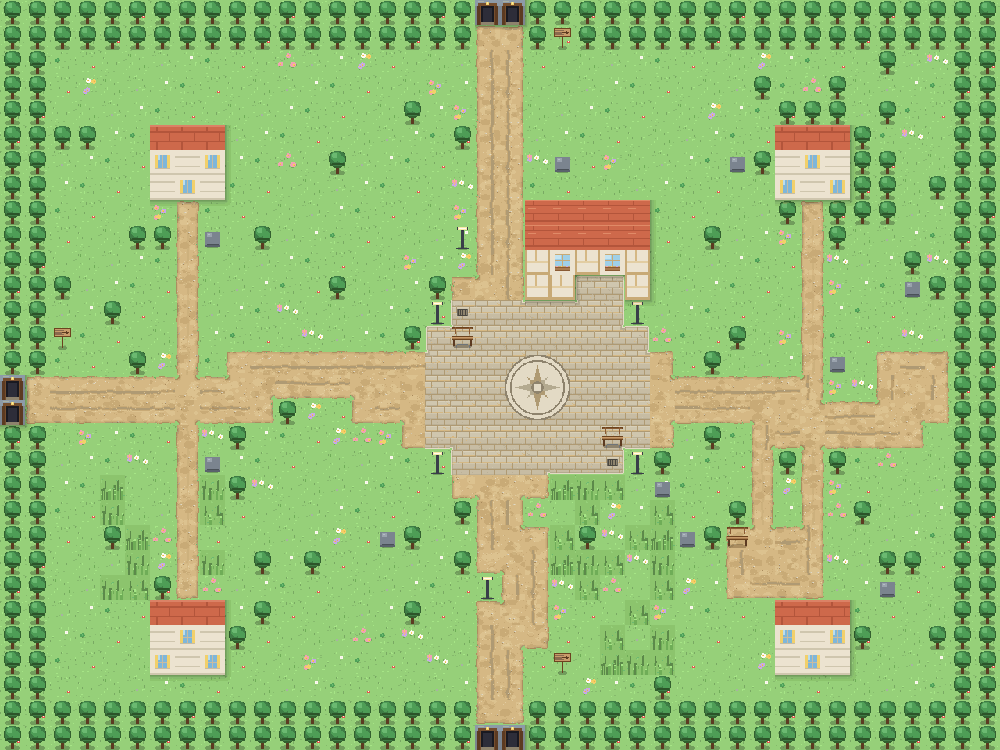
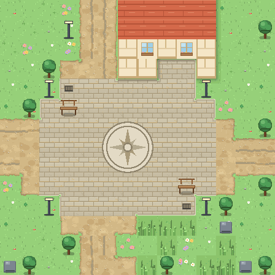
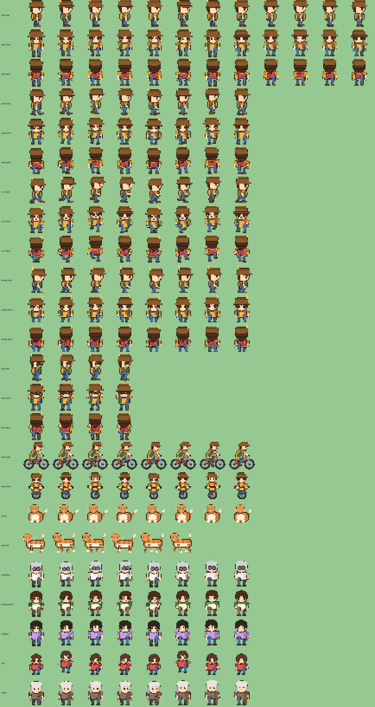

# Pizza and Bird : 피자와 새 — 게임 기획 문서 (GDD)

> 이 문서는 게임의 전체 설계를 기록합니다. 새 기능을 추가할 때 이 문서를 업데이트하세요.
> v0.3.3 (피자 계열 확장 + 초디테일 그래픽 파이프라인) 기준 — v0.3.2 날씨·디테일 연출 포함

---

## 1. 컨셉

- **한 줄 정의**: 피자를 굽고, 탐조를 하는 한국 배경 픽셀 힐링 게임
- **감성**: 아기자기한 픽셀 아트, 느긋한 속도, 수집의 즐거움, 실제 한국 지역 여행의 정취
- **플랫폼**: Android (오프라인 전용, 권한 없음)
- **수익 모델**: (출시 후 결정 — 유료 앱 or 광고 없는 무료)

## 2. 핵심 시스템

### 2.1 배고픔 수치 (hunger, 0~100)
- 이동/자전거/달리기로 서서히 감소 (달리기 > 자전거 > 걷기 > 정지)
- 0이 되면 이동 속도 45% 감소 ("배고파요…" 경고)
- 피자 섭취로 회복 — 🍕 버튼/E 키로 언제든 간식 (제일 좋은 품질부터 자동으로)

### 2.2 행운 수치 (luck, 0~100)
- 상승: 새로운 새 첫 발견 +4, 피자 섭취(+5~+18+토핑 보너스), 잠자기 +5, 벤치 휴식 +2, 고양이 쓰다듬기 +1
- 시간이 지나면 천천히 감소
- **희귀새 스폰 가중치 배율**: `weight × (1 + (실효행운/100) × (tier-1) × 1.4)`
  - 예) 행운 100에서 전설(4성) 새는 기본 대비 약 5.2배 자주 출현
- **집 장식 보너스**: 설치한 소품의 행운과 완성한 컬렉션 세트 효과가 실효 행운에 합산 (상한 100)

### 2.3 피자 (v0.3.3 — 화덕피자 / 일반 피자 두 계열, 12종)
- 집에는 조리기구가 **두 개**: 장작 **화덕**(🔥, 2×2)과 그 옆의 **가정용 오븐**(🍕, 1×2). 어느 것에 말을 거느냐로 굽는 계열이 정해진다.
- 굽기 3단계: ① 계열 메뉴에서 피자 선택(6종 카드) → ② 타이밍 게이지 → ③ 결과
- **계열** (`PizzaKind`):
  | 계열 | 굽는 곳 | 특징 | 노랑(맛있는) 구간 폭 |
  |---|---|---|---|
  | 🔥 화덕피자 | 화덕 | 얇은 도우를 400도에서 순식간에 — 커서 빠름, 금방 탐, 대신 효과(특히 행운) 큼 | 0.20 (좁음) |
  | 🍕 일반 피자 | 가정용 오븐 | 도톰하고 익숙한 피자 — 굽기 쉽고 든든 | 0.26 (넓음) |
- **메뉴 12종** (`Pizzas.ALL`, id = 세이브 인덱스라 순서 고정):
  | id | 계열 | 피자 | 배고픔 보너스 | 행운 보너스 | 커서 속도 | 걸작 폭 | 난이도 |
  |---:|---|---|---:|---:|---:|---:|---|
  | 0 | 일반 | 🧀 치즈 | +0 | +0 | 1.00 | 0.26 | ● |
  | 1 | 일반 | 🍄 버섯 | -4 | +6 | 1.15 | 0.32 | ●● |
  | 2 | 일반 | 🥩 불고기 | +8 | +2 | 1.38 | 0.20 | ●●● |
  | 3 | 일반 | 🍕 페퍼로니 | +6 | +1 | 1.10 | 0.26 | ● |
  | 4 | 일반 | 🍠 고구마 | +4 | +5 | 1.22 | 0.26 | ●● |
  | 5 | 일반 | 🥓 콤비네이션 | +10 | +3 | 1.30 | 0.22 | ●●● |
  | 6 | 화덕 | 🍅 마르게리타 | +4 | +8 | 1.45 | 0.22 | ●●● |
  | 7 | 화덕 | 🌿 마리나라 | +0 | +10 | 1.40 | 0.24 | ●●● |
  | 8 | 화덕 | 🧀 콰트로 포르마지 | +10 | +6 | 1.55 | 0.20 | ●●●● |
  | 9 | 화덕 | 🍯 고르곤졸라 | +2 | +14 | 1.60 | 0.18 | ●●●● |
  | 10 | 화덕 | 🌶 디아볼라 | +12 | +4 | 1.70 | 0.18 | ●●●●● |
  | 11 | 화덕 | 🥗 루꼴라 프로슈토 | +8 | +12 | 1.75 | 0.16 | ●●●●● |
- 품질: 살짝 탄(+20/+5) / 맛있는(+38/+10) / 걸작(+60/+18) — (배고픔/행운, 여기에 피자별 보너스 추가)
- 최대 6개(PIZZA_CAP)까지 들고 다니며 이동 중에도 먹을 수 있음. 🍕 간식 버튼은 **품질이 높은 것 → 같은 품질이면 배고픔 회복이 큰 것** 순으로 먹는다
- 메뉴 '피자' 탭: 🔥 화덕피자 / 🍕 일반 피자 서브탭 → 2열 카드(종류별 픽셀 아이콘·효과·난이도·품질별 재고·냠냠 버튼)
- **아이콘**: 템플릿에 종류별 팔레트를 입혀 자동 생성 (치즈 밝기·그늘, 토핑 테/윤은 각 색에서 파생) — 일반 피자는 통통한 황금 크러스트 + 토마토 소스 링(`art/svg/items.svg #art_pizza` 와 동일 디자인, `tools/pizza_lab.py --dump-ascii`로 추출), 화덕피자는 얇고 군데군데 그을린(레오파드) 러스틱 크러스트 + 큼직한 토핑. 검수: `tools/pizza_arts_preview.py`
- **세이브**: `pizzas[id*3 + 품질]` (v4). v2/v3의 9칸(치즈·버섯·불고기)은 id가 같아 그대로 앞 9칸에 들어간다

#### 피자 확장 (v0.4.x 「사계」 [P07](plan/P07_pizza_dough.md)) — 도우 3종 + 지역 특산 8종

- 굽기가 **3단**이 된다: ① **도우 선택**(`DoughOverlay`) → ② 피자 선택 + 현재 지역 **✈ 특산** 탭(`BakeOverlay`) → ③ 타이밍 굽기
- **도우 3종** (`Dough`): 🍞 클래식(무료 · 속도 ×1.00) / 🫓 은 화덕(₩1,500 · ×1.12 · 판정 폭 −8% · 굽자마자 행운 +3) / 🌾 통밀(₩2,000 · ×0.88 · 판정 폭 +8% · 굽자마자 배고픔 +8)
  — 도우 보너스는 **구워 낸 순간 즉시** 적용된다 (피자에 붙어 다니지 않아 먹기 로직·세이브를 건드리지 않는다)
- **지역 특산 피자 8종** (id 12~19, 전부 화덕 계열 — **id·순서 영구 고정**, 세이브 인덱스):
  | id | 피자 | 지역 | 재료가 | 배고픔+ | 행운+ |
  |---:|---|---|---:|---:|---:|
  | 12 | 🍗 춘천 닭갈비 | 춘천 | ₩3,000 | +12 | +3 |
  | 13 | 🥔 강릉 감자 옹심이 | 강릉 | ₩2,500 | +14 | +2 |
  | 14 | 🦑 속초 오징어 | 속초 | ₩3,500 | +10 | +5 |
  | 15 | 🫘 전주 콩나물 비빔 | 전주 | ₩2,800 | +11 | +4 |
  | 16 | 🧀 대구 납작 치즈 | 대구 | ₩2,600 | +9 | +4 |
  | 17 | 🥬 광주 상추 육전 | 광주 | ₩3,200 | +12 | +4 |
  | 18 | 🐟 부산 어묵 꼬치 | 부산 | ₩2,900 | +11 | +3 |
  | 19 | 🐖 제주 흑돼지 | 제주 | ₩5,000 | +16 | +6 |
- **팬트리** (`Ingredients`, 저장 키 `feat_pantry_v1`): 특산 재료는 **그 지역에서만** 사들이고(골드 즉시 차감), 재고는 팬트리에 보존(재시작 유지)·사용도 **그 지역에서만** — 특산 탭은 현재 지역에 특산이 있을 때만 보이고 지역을 떠나면 숨는다
- 메뉴 '피자' 탭 카탈로그에는 특산 피자가 **"✈ 지역 특산" 뱃지**로 표시된다(탭 구조 무수정). 굽기 메뉴의 일반 그리드는 기존 12종 그대로이고 특산은 특산 탭에서만 고른다
- 간식/먹기·도감·아이콘 파이프라인은 기존 `Pizzas.ALL` 순회·자동 생성 규약을 그대로 탄다 (`Assets.kt` 무수정)

### 2.4 탐조 & 카메라
- 필드에 새가 스폰됨 (지역별 서식지 풀 + 등급별 가중치 + **낮/밤 출현 조건**)
- 새는 플레이어가 가까이 오면 도망 (등급이 높을수록 민감, 자전거 탑승 시 모델·부속품에 따라 1.18~1.58배 민감)
- 🪨 **지형지물 은엄폐** — 새와 플레이어 사이에 바위·나무·산·건물(`bulk`·TREE·ROCK)이 있어 시야가 막히면 도망 반경이 −55%(`FieldBird.HIDDEN_FLEE_K = 0.45`, 최소 9월드px)로 준다. 벤치·가로등·이정표처럼 키 낮은 소품은 숨을 수 없다. 숨은 채로 평소 도망 반경 안에 있으면 새가 경계 자세로 두리번거리기만 하고, 뷰파인더 AF 라벨에 `🌿 숨어있음`이 초록색으로 뜬다
- 📷 **카메라 모드**: 시간이 35%로 느려지고, 내 이동속도 50%, 새의 경계 범위 40% 감소
  - 카메라 모드 동안 HUD(스탯 패널·미니맵·의뢰 칩)는 숨겨지고 화면 전체가 뷰파인더가 된다

#### 뷰파인더 화면 (v0.3.1 대개편)
실제 카메라 앱처럼 보이도록 다음 요소를 그린다 (`Viewfinder.kt`).



| 요소 | 설명 |
|---|---|
| 프레임 | 모서리 브래킷(흰색 + 금색 포인트), 3분할 그리드, 좌우 조리개 눈금, 중앙 십자 |
| 비네트 | 네 변에서 안쪽으로 부드럽게 어두워짐(8단 그라데이션) + 필름 그레인 + 약한 청록 색감 |
| 상단 바 | ● PHOTO 표시등(깜빡임) · 시각(해/달 아이콘) · 장비 이름/등급/사거리/누적 사진 수 |
| 하단 바 | ISO·조리개·셔터(장비 등급에 따라 변함) · 도감 현황 · **거리 게이지**(★3/★2/★1 구역) |
| AF 박스 | 조준 중인 새에 초점 브래킷 + 이름(미발견은 `??? 미확인`) + 예상 별점 + 거리(칸) |
| 사거리 링 | 카메라 등급별 촬영 반경 점선 원(회전하는 대시) + ★3/★2 경계 링과 라벨 |
| 주변 새 | 사거리 안의 다른 새는 예상 별점만 조그맣게 표시 |
| AF 획득 연출 | 조준 대상이 바뀌면 바깥에서 안으로 좁혀오는 링 |
| 셔터 | 촬영 시 위·아래 셔터 블레이드가 닫히며 날 끝에 빛이 번짐 → "찰칵!" → 화이트 플래시 |
| 되돌아오기 | 결과 카드를 닫으면 닫혀 있던 셔터가 다시 열린다 |

- 촬영 반경 내 새를 탭 → 거리 기반 별점(1~3성) + 카메라/행운 보너스
  (카메라 모드에선 AF 박스를 살짝 빗나가게 탭해도 잡히도록 탭 판정 반경을 14 → 21(월드 px)로 넓힌다)

#### 촬영 결과 (폴라로이드 인화)
사진 결과 카드는 **폴라로이드 인화지**로 연출한다 (`PhotoResultOverlay`).

- 결과 카드가 뜨기 전 0.15초는 셔터가 닫힌 채로 멈췄다가 열린다(찰칵 → 인화 느낌)
- 인화지: 살짝 기울어진 종이 + 이중 그림자, 사진 위에 이름/등급·활동 시간·영문명 캡션
- **사진 속 풍경**은 서식지(바다·물·습지·숲·산·도시)와 낮/밤에 따라 달라진다
  (6단 하늘 그라데이션, 지평선 안개, 구름/별, 해/달, 물결·건물 불빛·언덕, 새 실루엣)
- 별점은 좌→우로 하나씩 튀어나오고, 첫 발견이면 대각선 **NEW 첫 발견 스티커**
- 하단 메타데이터: 카메라 이름 · 촬영 거리(칸) · 시각 · 누적 촬영 횟수, 의뢰 완료 시 보수 칩
- **카메라 등급** (**서울 망원동 사진용품점**에서 ₩으로 업그레이드 — 상점 주인 남기택도 한 곳에 산다.
  메뉴 › 상태 탭의 "🏬 사진용품점" 칸이나 대화 안내에서 바로 이동 가능):
  | Lv | 이름 | 촬영 반경 | 가격 |
  |---|---|---|---|
  | 1 | 폰 카메라 | 4.5칸 | 기본 |
  | 2 | 컴팩트 카메라 | 6.0칸 | ₩80,000 |
  | 3 | 미러리스 | 7.5칸 | ₩250,000 |
  | 4 | DSLR | 9.0칸 | ₩600,000 |
  | 5 | 프리미엄 DSLR | 11.0칸 | ₩1,500,000 |
- Lv3+부터 별점 상승 확률 보너스

### 2.5 도감
- 새별 **촬영 횟수 + 최고 별점** 누적 기록
- 첫 발견 시 ✨표시, 미발견은 "???"로 표시 (등급 테두리 색으로 힌트)
- 촬영한 새 정보(설명/등급/서식지/출현 시간) 열람 — 새를 탭하면 상세 정보

### 2.6 보리 박사 (조류학자 NPC) — **광릉숲 한 곳에만 산다**
- 「한 사람은 한 장소에만」 원칙: 보리 박사는 **광릉숲(gwangneung) 숲속 쉼터**에 사는 단 한 명의 박사다.
  의뢰 수락과 메인 스토리 보고는 모두 광릉숲에서 이루어진다.
- 다른 지역에서 목표가 끝나면 안내가 자동으로 광릉숲을 가리킨다 —
  퀘스트 카드 탭 · 보리 박사 대화의 "🚲 이동하기" · 메뉴 › 상태 탭의 안내 모두 같은 목적지.
  광릉숲에 도착하면 스폰 지점(FAST)이 **박사 쉼터 바로 옆**이 되어 걸어갈 필요가 없다.
- 진행 중인 의뢰가 없으면 머리 위에 "!" 표시
- **탐조 의뢰 게시판**: 지정 조류·서식지 탐사·3성 촬영·특별 탐사 4가지 후보 중 선택, **최대 3개 동시 진행** + 매일 갱신 **일일 미션 3개** 자동 수락
- 지정 조류 의뢰: "이 지역의 ○○를 찍어다 주게" → 지역 새 풀에서 선택
  - 아직 찍지 않은 흔함/보통 새를 우선 제안 (60% 확률)
- 의뢰 새를 촬영하는 순간 **자동 완료 & 즉시 보수 지급** (지정 조류 3성이면 +30% 보너스)
- 의뢰는 언제든 포기 가능 (개별/전체)

### 2.7 메인/서브 퀘스트와 탐조 이정표

- **메인 스토리 「함께 사는 지도」**: 보리 박사와 할머니의 낡은 탐조 수첩을 이어 쓰는 8장 구조.
  - 프롤로그 → 동네 새 → 딱다구리 3종 → 물총새과 → 철새 → 도요 → 서식지 보전 → 마지막 장
  - 레벨·라이퍼·방문 지역·3성 사진·컬렉션을 함께 요구해 기존 핵심 루프가 자연스럽게 이어진다.
  - 마지막 장은 **Lv.25**가 조건이며 완료 후 메인 진행은 멈춘다.
  - **자동 진행 어드바이저**(`MainQuestAdvisor`): 현재 장의 목표를 분석해 "지금 어디로 가야 하는지"를 자동 계산.
    - 우선순위: ① 컬렉션 미완료 → 남은 새가 가장 많이 출현하는 지역(낮+밤 풀 통합) ② 방문 부족 → 지역 루트 그래프 BFS로 가장 가까운 미방문 지역 ③ 레벨·라이퍼·3성 부족 → 아직 못 찍은 새가 가장 많은 지역 ④ 목표 달성 시 → **보리 박사가 사는 광릉숲**(보고하러 간다. 다른 지역이면 안내 카드가 광릉숲을 가리킨다).
    - **메인 퀘스트 카드(메뉴 › 퀘스트 탭) 탭** = 자동 진행: 추천 지역으로 `fastTravel` (페이드+바람 SFX, 중앙 광장 스폰, 광릉숲에서는 **보리 박사 쉼터 옆** 스폰). 이미 추천 지역이면 이동 대신 도착 팁 토스트.
    - 보리 박사 대화에도 "🚲 이동하기" 선택지, 미니맵엔 금색 ★+펄스 링으로 추천 지역 표시.
    - 결과 캐시(진행도/종수/3성수/방문수/현재 지역 키) — 미니맵 매 프레임 요청에도 비용 없음.
- **탐조 의뢰(서브 퀘스트)**: 메인과 완전히 독립된 슬롯(최대 3개). 어느 장에서든 수락·포기·완료할 수 있고 시간 제한이 없다. 메인 완결 뒤에도 반복 가능하다.
- **NPC 반응**: 그 지역에 사는 사람들은 현재 장에 맞는 생태·관찰 예절 이야기를 하고(지역 이야기 담당),
  지역 고유 인물(한강 라이더·설악 등산 안내·하도리 해녀…)은 자기 자리를 배경으로 잡담·이모트를 보인다.
- **라이퍼 이정표**(공인 자격 아님): 입문 0~29 / 초보 30~99 / 중수 100~199 / 고수 200~299 / 초고수 300~399 / 종새꾼 400종 이상.
- **도장 깨기 70세트**: 딱다구리 기본/상급, 박새류, 물총새과, 여름 숲, 푸른 깃, 겨울 오리, 두루미, 수리, 밤새, 도요, 보전종, 뜸부기과, 바다 원정 등.
- 종명은 한국조류학회 2025 v2.1 표준명을 사용한다. 청도요는 도요류이므로 물총새과 세트에서 제외하고, `물총새·호반새·청호반새·뿔호반새`를 사용한다.

### 2.8 지역 이동 (포켓몬 스타일)
- **탈것은 자전거뿐** — 자동차·오토바이 등 다른 탈것은 존재하지 않는다 (아크 버튼 🚲 탑승, 속도 약 1.75배, 뒤흙 파티클)
- **자전거 모델 11종** (Bikes): 기본/시티/미니벨로/MTB/로드/크루저/BMX/픽시/전기/탠덤/빈티지 하이휠
  - 모델별 성능 차이: 속도 ×0.96~1.42, 배고픔 소모 ×0.70~1.18, 새 놀람 ×1.18~1.58, 일부 모델은 행운 보너스
- **자전거 커스텀** (사진용품점 › 자전거 상점)
  - 모델 구매/교체 (기본 자전거는 항상 보유)
  - 도색: 프레임 12색 · 바퀴 6색 · 안장·그립 6색 (무료, 즉시 반영 — 스프라이트는 스타일별로 생성·캐시)
  - 부속품 5종: 라탄 바구니·짐받이(피자 +1), 전조등(새 놀람 -15%), 스트리머·방울(행운 +1)
- **달리기** (키보드 Shift, 걸을 때만): 속도 ×1.45, 배고픔 소모 큼
- 지도 가장자리의 **터널**로 들어가면 연결된 지역 맵 로딩 (페이드 전환)
- 40×30 지역 맵은 북쪽을 위로 고정하고, `waterEdges`/`sandEdges`에 따라 서해·동해·남해를 실제 방향에 둔다. 서해 갯벌은 넓은 모래·갈대 띠, 동해안은 좁은 해변, 하천·호수는 지역마다 다른 위치에 놓인다.
- 지역별 풀·물·모래·바위 색뿐 아니라 **바위 실루엣(현무암 기둥·강자갈·해식 층리·화강암 노두), 나무(곰솔·동백·은행·버드나무·대나무·전나무), 꽃·갈대 무늬**도 다르게 배치한다. 갯벌 갈대섬·들판 억새띠·강자갈 둔덕·십리대숲·용암석 군락 같은 지역 자연물이 길 주변에 이어진다. 한강(서울), 갑천(대전), 전주천·신천·광주천·태화강, 금강 하구, 임진강, 낙동강 하구, 순천만 물길 등을 지역 배치로 표시한다.
- 터널 그림은 안쪽 진입로를 향해 회전하고, 이정표 화살표와 지도 정보는 실제 연결 방향(북·동·남·서)을 표시한다.
- **텔레포트 기능 없음** — 반드시 터널을 경유 (단, **메인 퀘스트 자동 진행**은 예외: 메인 퀘스트를 누르면 어드바이저가 정한 추천 지역으로 자전거 이동)
- 터널 입구에 **이정표** — A버튼/탭으로 목적지 안내 ("이 터널 → 부산")
- 부산↔제주는 해저 터널 (스토리상 자전거 여행자의 무모한 도전)

### 2.8 집 & 이사 & 장식
- 새 게임의 시작 지역은 **서울로 고정**. 서울 집과 기본 인테리어를 무료로 제공한다.
- 집 내부: 화덕(기본, 화덕피자) / 가정용 오븐(기본, 일반 피자 — 화덕 오른쪽 주방 코너) / 침대(**수면 → 아침 7:12 + 행운 +5** + 저장) / **이사 박스** / **인테리어 보드** / **장식 칸 8곳**
- 화덕과 오븐이 나란히 있으므로 상호작용은 **가장 가까운 대상**을 고른다 (A 버튼·탭 모두)
- 방문한 지역의 이사 박스에서 집 매입을 선택한다. **집값 + 이사비 ₩300,000**을 지불하면 해당 지역 주택을 소유하고 이사한다. 이미 산 집은 이사비만 낸다.
- 지역별 집 매매가: 서울 ₩85,000,000 · 인천 ₩42,000,000 · 춘천 ₩30,000,000 · 강릉 ₩38,000,000 · 속초 ₩36,000,000 · 대전 ₩32,000,000 · 전주 ₩25,000,000 · 대구 ₩28,000,000 · 광주 ₩26,000,000 · 울산 ₩34,000,000 · 부산 ₩52,000,000 · 제주 ₩48,000,000
- **인테리어 시스템**: 집 안의 인테리어 보드에서 구매/적용. 구매한 스타일은 이사 후에도 유지된다.
  | 스타일 | 리모델링 비용 | 특징 |
  |---|---:|---|
  | 🪵 햇살 가득 아늑한 집 | 무료 | 나무 바닥·크림색 벽 |
  | 🏯 서울 한옥 감성 | ₩5,000,000 | 한지 벽·나무 기둥 |
  | 🛋 모던 스튜디오 | ₩12,000,000 | 회색 벽·청록 포인트 |
  | 🪴 초록 정원형 | ₩20,000,000 | 초록 벽·식물 포인트 |
- **장식 시스템 (확장)**: 사진용품점 '장식 코너'에서 소품 구매 → 집의 **8칸 배치 보드** 또는 개별 장식 칸에서 배치한다.
  - 한 소품은 한 칸에만 둘 수 있어 같은 물건을 중복해 쌓을 수 없다. 배치 보드에서는 빈 칸/보유 소품을 한눈에 보고, **자동 정리**와 **모두 비우기**를 쓸 수 있다.
  - 상점은 `아늑한 집` / `탐조 작업실` 두 카탈로그로 나뉘며, 선택창은 많은 소품을 6개씩 넘길 수 있다.
  | 장식 | 가격 | 행운 |
  |---|---:|---:|
  | 🌵 선인장 화분 | ₩40,000 | +1 |
  | 📓 관찰 노트 | ₩60,000 | +2 |
  | ✉️ 여행 엽서판 | ₩70,000 | +2 |
  | 🧶 포근한 러그 | ₩80,000 | +2 |
  | 🪴 몬스테라 화분 | ₩90,000 | +1 |
  | 📻 빈티지 라디오 | ₩100,000 | +2 |
  | 🪑 캠프 체어 | ₩110,000 | +1 |
  | 📚 원목 책장 | ₩120,000 | +2 |
  | 🖼 새 사진 액자 | ₩130,000 | +2 |
  | 💡 스탠드 조명 | ₩150,000 | +2 (밤에 은은한 조명 효과) |
  | 🎶 레코드 플레이어 | ₩180,000 | +2 |
  | 🏆 탐조 트로피 | ₩250,000 | +3 |
  - **컬렉션 세트 효과**: 실제로 배치한 소품만 판정한다. 포근한 음악방(러그·조명·라디오) +3 / 초록 창가(선인장·몬스테라) +2 / 탐조 작업실(책장·새 사진 액자·관찰 노트) +4 / 여행의 벽(트로피·여행 엽서판) +2 행운.

### 2.9 낮/밤 순환 (v0.2)
- **하루 = 실제 5분** (DAY_SECONDS=300). 오전 8:30에 시작
- 시간 흐름: 집 안에선 40% 속도, 밖에선 정상 속도
- 세계 틴트가 시각에 따라 변화: 밤(짙은 남색) → 새벽(주황) → 낮(없음) → 노을 → 밤
- **밤(19:30~04:30) 전용 새**: 올빼미(숲), 검은댕기해오라기(물가/습지), 수리부엉이(산/숲 — 속초·제주·울산·대구 한정)
- 밤이 되면 **가로등/창문이 은은하게 빛남** (홈 내부 스탠드 조명도)
- 밤새 풀이 비어도 지역의 경우(전주) 낮 풀로 폴백 — 항상 새가 나옴
- HUD에 시계(☀/🌙 아이콘)와 시각 표시

### 2.10 거리 감 & 파티클 (v0.2)
- **골목 고양이**: 지역마다 1~2마리. 근처 새를 쫓아 놀라게 한다(잡아먹지 않는다 — 새는 놀라 날아간다). 👊 펀치(F / 펀치 버튼 / 주먹 메인 버튼 / 고양이 탭)를 맞으면 회전하며 날아가고, 잠시 뒤 다른 골목에서 다시 나타난다. 덮치기를 막으면 행운 +1, 가만있는 고양이를 때리면 친밀도 −5. ♡ 탭은 쓰다듬기(행운 +1)
- **벤치**: 광장 2개 + 호숫가 전망 데크 + 숲속 쉼터, 앉으면(탭/A) 행운 +2
- **가로등**: 도시 지역 광장 모서리 4개 + 간선도로변 도열, 밤에 빛남
- **지역별 앰비언트 파티클**: 숲=낙엽, 습지=꽃잎/밤엔 반딧불, 바다=물반짝, 속초·제주=눈
- **구름 그림자**: 지도 위를 천천히 지나가는 큰 그늘
- 자전거 바퀴 흙먼지, 촬영 시 깃털 파티클, 첫 방문/지역 도착 배너

### 2.12 날씨 & 디테일 연출 (v0.3.2 — `Fx.kt`)
- **날씨** 자체(종류·변화 주기·새 출현 가중치)는 `Weather.kt` + `WorldScene.updateWeather` (50~105초마다 변화). `Fx.kt`는 연출과 체감 배율만 담당한다
  | 날씨 | 화면 연출 (Fx) | 체감 배율 (Fx) |
  |---|---|---|
  | ☀ 맑음 | 구름 그림자 3조각, 진한 햇빛 그림자, 윤슬, 나비 최대 4 | — |
  | ☁ 흐림 | 회색 틴트, 구름 그림자 6조각, 옅은 그림자 | — |
  | ☂ 비 | 빗줄기·땅 튀김, 물 위 빗방울 파문, 포장길 **물웅덩이**(그친 뒤에도 서서히 마름), 젖은 발자국, 철새 그림자 없음 | 새 경계 ×0.92, 스폰 간격 ×1.15 |
  | ≋ 강풍 | 휙휙 지나가는 바람결, 구름 그림자가 3배 빠르게 지나감 (+ 기존 바람 파티클) | — |
  | ❄ 눈 | 눈송이, 풀밭·지붕·나무·굴뚝에 **눈이 쌓임**, 눈 발자국 | 스폰 간격 ×1.1 |
- **게임 내 날짜** `GameState.day` — 자정을 넘기거나 침대에서 자면 +1 (세이브에 저장, 없으면 1일). 침대에서 자면 다음 날 아침 7시
- **조명 맵** `LightMap` — 화면 크기 어둠 레이어에 방사형 빛 구멍(DST_OUT)을 뚫고 덮은 뒤 전구색 번짐(`Glow.warm`)을 얹는다
  - 광원: 가로등(+바닥 빛 웅덩이, 깜빡임) · 집/건물 창문 · 터널 등 · 반딧불(밤 풀숲/갈대) · 플레이어 주변
  - 밤 어둠 alpha 96 → 124 로 조금 더 깊게 (대신 광원이 확실히 밝다)
- **햇빛 그림자** — 나무·가로등·이정표·바위가 시각에 따라 기우는 긴 그림자를 드리운다 (아침 서쪽 ↔ 저녁 동쪽, 정오에 가장 짧음). 흐림/비/눈이면 옅어짐
- **물** — 뭍에서 멀수록 짙은 물(BFS 깊이 3단계), 반짝이는 윤슬(밤엔 달빛), 물가에서 찰랑이는 두 번째 거품 줄, 물가 흙은 촉촉한 띠, 물고기 점프 파문
- **발걸음** — 모래 발자국 · 자전거 바퀴 자국 · 눈 발자국 · 젖은 발자국(8~10초 후 사라짐), 풀잎/꽃잎/갈대 잎 튀김, 달릴 때 흙먼지, 물웅덩이 찰박
- **풀숲** — 키 큰 풀/갈대 위에선 플레이어·고양이·새의 발목을 풀잎이 덮고 걸으면 흔들린다
- **작은 생물** — 나비(꽃밭, 맑은 낮), 잠자리(물가/갈대, 정지비행→휙), 나방(밤 가로등 주위), 머리 위 V자 **철새 무리 그림자**
- **NPC** — 가까이 가면 이름표(`이름 · 별명`), 사람마다 다른 팔레트·모자·조끼·스카프와 대기 동작,
  가끔 말풍선 이모트(♪ … 🍵 💤 📷 🔍 🦆 🌿 등 — 날씨/밤낮·직업 반영), 고양이는 밤에 쿨쿨(z)
- **우리 집** — 지붕 굴뚝에서 연기가 피어오름
- **집 안** — 창밖 하늘이 시각·날씨에 따라 변함(별·초승달·뭉게구름·빗줄기·눈송이), 창으로 들어온 햇살이 바닥에 비치며 기울기가 바뀌고 먼지가 반짝임,
  게임 시각을 가리키는 **벽시계**, 화덕 불티·연기·일렁이는 불빛, 밤엔 화덕/스탠드 조명만 방을 밝힘

### 2.13 몰입 카메라 (v0.4.1) — 화면이 "살아 있게"

> 목표: 탑다운 2D인데도 **그 자리에 서 있는 것 같은** 감각. 카메라를 하나의 캐릭터처럼 다룬다.
> 구현은 전부 `ViewRig.kt`의 `ViewRig`에 모여 있고, 씬은 값을 읽어 쓰기만 한다.

| # | 기법 | 게임에서의 모습 | 핵심 수치 |
|---|---|---|---|
| 1 | **카메라 셰이크** | 셔터, 벽 충돌, 새 무리가 푸드덕 날아오름, 레벨업, 터널 진입 | trauma 0~1 · `trauma^1.5` 감쇠(1.4/s) · 최대 ±16 논리px · roll ±1.4° |
| 2 | **헤드 밥 & 바디 스웨이** | 걸음마다 화면이 위아래로, 몸이 좌우로. 자전거는 노면 진동까지 | 보폭 걷기 2.05Hz / 달리기 2.85Hz / 자전거 1.45Hz (속도비 ±22% 보정) |
| 3 | **모션 블러 & 동적 FOV** | 달리기·자전거에서 잔상 2장 + 속도선 + 가장자리 비네트, 시야가 넓어짐 | zoom 자전거 0.925 / 달리기 0.955, 시정수 0.40s |
| 4 | **카메라 딜레이 & 예측 배치** | 칼같이 따라붙지 않고 살짝 늦게, 진행 방향 앞쪽을 더 보여줌 | 임계감쇠 smoothTime 0.19~0.26s · 데드존 2.2px · 룩어헤드 14/22/34px |
| 5 | **다이내믹 포커싱(심도)** | 카메라 모드에서 가장 가까운 새를 자동으로 잡고, 초점 밖을 눌러 어둡게 | 초점 반경 이징 0.26s · 망원 zoom 1.03~1.22(장착 렌즈 환산 초점거리) · 심도는 조리개(F값)로 |

부가 연출
- **히트스톱**: 셔터 순간 0.09초 동안 세계만 12% 속도 → 결정적인 순간을 '느끼게' 한다. 카메라는 계속 살아 있다.
- **플래시 + 지연 결과창**: 셔터 → 흰 플래시(6.4/s 감쇠) → 새가 날아오르는 0.36초를 보여준 뒤 결과 카드.
- **발소리 펄스**: 헤드밥의 착지 위상마다 아주 작은 하강 킥(0.10~0.30px). 달릴 때는 같은 타이밍에 발먼지.
- **오버레이 뒤에서도 카메라는 돈다** — 화덕 미니게임의 '쿵'이 대화창 뒤 방을 흔든다.

접근성 — **3D 멀미(모션 시크니스) 대응이 기본**
- 설정 › 화면 연출에서 6가지를 각각 끌 수 있다. 흔들림은 **끔/약하게/보통/강하게 4단계**(배수 0 / 0.55 / 1 / 1.6).
- 값을 바꾸면 그 자리에서 미리보기 흔들림이 재생된다. 설정은 `GameState`(세이브 v4)에 저장되고 **새 게임에서도 유지**된다.
- HUD·오버레이는 절대 흔들지 않는다(가독성). 흔들림은 월드 레이어에만 적용.
- 뷰파인더(`Viewfinder.kt`)의 AF 박스·사거리 링도 같은 망원 배율을 받아 표식이 정확히 겹친다.
- 장비(`Cameras.kt`의 `CameraRig`)와 화면 움직임(`ViewRig.kt`의 `ViewRig`)은 서로 다른 것이다.
  망원 배율은 렌즈의 환산 초점거리, 심도는 개방 조리개(F값), 사거리는 `rig.reach` 를 그대로 따른다.

### 2.11 경제 (대한민국 원)
- 게임의 금액 타입은 모두 **원(Int)**이며 UI에는 `₩`와 천 단위 쉼표를 함께 표시한다.
- 시작 지갑: ₩30,000. 수입: 박사 의뢰 보수 (흔함 ₩3,000 ~ 전설 ₩65,000, 3성 보너스 포함)
- 지출: 카메라 업그레이드(₩80,000~₩1,500,000), 이사비 ₩300,000, 장식 소품(₩40,000~₩250,000), 주택 매입 및 인테리어
- 장기 목표: 사진 의뢰를 수행해 원하는 지역의 집과 인테리어를 마련한다.
- (추후) 사진 판매, 피자 재료 구매

### 2.13 살아있는 풀 (Living Grass)

풀은 타일에 구워넣은 정적 이미지가 아니라, **풀잎 개개별 스프라이트 + 상태 머신**으로 움직인다.
듀오(Duo) 애니메이션의 내부 구조 — *리그 + 작성된 상태 + 상태 간 트윈* — 를 픽셀 아트에 그대로 적용했다.

#### 구조 (`Grass.kt` / `Assets.kt`)

| 층 | 내용 |
|---|---|
| **RIG** | 풀잎 하나 = ROOT → MID → TIP 3단 뼈대. 세로줄을 1px씩 내려가며 x를 **정수**로 누적해 그리기 때문에, 바람에 휘어도 앤티앨리어싱 없이 항상 "계단식 픽셀 선"이 유지된다. (float 회전 + 스케일은 픽셀이 뭉개지므로 금지) |
| **POSE** | 5종 × lean 11 × curl 7 = **385장 사전제작 포즈**(약 490KB). 상태 머신은 인덱스만 골라 `drawBitmap` 1회로 그린다 |
| **STATE** | `IDLE` / `SWAY` / `GUST` / `BEND` / `RECOVER` 5개 노드. 노드마다 스프링 (k, d) 가 달라 목표값으로의 이동이 Lottie 키프레임 트윈처럼 동작 |
| **INPUT** | 바람 필드 `wind(x, t)` = 저주파 호흡 + 2겹 진행파 + **화면을 실제로 가로지르는 돌풍**(7.2초 주기). 풀잎마다 `phase01`이 달라 전부가 같은 타이밍에 움직이지 않는다 |
| **REACT** | 캐릭터 발/바퀴가 밟으면 `BEND`(이동 방향으로 눕음) → `RECOVER`(감쇠가 낮아 반대편으로 오버슛하며 흔들리며 복귀) |
| **DEPTH** | 풀잎 밑동이 캐릭터 발끝보다 아래면 **전경 레이어**로 그려진다 → 진짜 밭을 헤치며 걷는 깊이감 |

#### 풀잎 5종 (`GRASS_KINDS`)

| # | 이름 | 높이 | 두께 | 색조 | 등장 지형 |
|---|---|---:|---|---|---|
| 0 | 새순 | 8px | 2 | 진한 초록 | 잔디밭(다수) |
| 1 | 기본 풀잎 | 12px | 2 | 표준 초록 | 잔디밭 / 꽃밭 |
| 2 | 긴 풀 | 17px | 3→1 | 밝은 산초 | 풀숲 `TALLGRASS` |
| 3 | 마른 풀 | 14px | 3→1 | 올리브 | 모래밭 `SAND` |
| 4 | 이삭/갈대 | 16px+穗 | 2 | 청록 + 이삭 | 갈대습지 `REED` |

내부 디테일: 3톤 명암(밝은 면 / 중간 / 그림자) + 그림자 쪽 1px 잎맥 점선 + 가운데 접힘 하이라이트 + 끝 하이라이트 + 기저부 접지 그림자.

#### 튜닝 상수 (`Grass.kt` companion)

| 상수 | 값 | 의미 |
|---|---:|---|
| `LEAN_AMP` / `CURL_AMP` | 5.2 / 1.6 | 바람 세기 → 기짐/휨 변환 배율 |
| `SWAY_TH` / `GUST_TH` | 0.22 / 0.56 | `SWAY`·`GUST` 상태 진입 바람 세기 |
| `K` / `D` | 15·27·42·150·28 / 6.4·5.6·4.1·9.0·3.2 | 상태별 스프링 (상태 순서 = IDLE·SWAY·GUST·BEND·RECOVER) |
| `RECOVER_T` | 0.6s | 밟힘 해제 후 오버슛 복귀 시간 |
| `SQUALL_PERIOD` / `_R` / `_AMP` | 7.2s / 210px / 0.92 | 돌풍 주기·영향 반경·세기 |
| 밟힘 반경 | 11px (자전거 15.5px) | `BEND` 진입 거리 |

#### 성능

- 풀잎 약 2.1개/타일(맵 전체 ~2,500, 화면 내 ~1,100). 갱신은 전부, 그리는 것은 뷰 안쪽만.
- 바람 필드는 **8px 열 단위로 한 번만** 계산하고 풀잎은 두 시점 값을 자기 위상으로 보간 → `sin` 호출이 풀잎 수에서 열 수로 감소.
- 포즈는 사전제작이라 드로잉 비용이 `drawBitmap` 1회. 총 메모리 약 490KB, 이미지 리소스 0개 유지.

#### 프리뷰 / 검증 (`tools/preview_grass_live.py`)

Kotlin 리그·바람 필드·상태 머신을 Python(PIL)로 1:1 재현해 이미지로 검증한다.
`grass_rig_sheet.png`(포즈 컨택트시트) · `grass_live_still.png` · `grass_live_anim.gif` ·
`grass_wave_strip.png`(돌풍 전선이 화면을 가로지르는 과정) · `grass_trample_strip.png`(밟힘→회복 오버슛).
(생성 이미지는 `.gitignore` 대상 — 게임 코드에는 영향 없음)

### 2.14 그래픽 렌더링 파이프라인 (v0.3.1 — 초디테일)

모든 그래픽은 `Assets.kt`에서 **코드로 생성**합니다 (외부 이미지 0개). v0.3부터 타일은
`타입별 add(vararg 변형)`로 등록되어 `tiles[T.ordinal][variant]` 인덱싱을 사용합니다.

- **텍스처 헬퍼**: `noise`(입자 노이즈) / `dither`(체커 디더) / `vgrad`(밴드 그라데이션+디더 전환) / `bevel`(하이라이트+음영 테두리) / `px·dot`(1px 정밀)
- **타일 29종**: 풀·들풀·꽃·자갈길/조경석/흙길·석판 광장·모래(조개·불가사리)·물(4프레임 애니메이션)·갈대·**나무 4종(참나무/소나무/벚나무/단풍)**·바위 2종·절벽/설산·벽돌 건물·창문(유리 그라데이션+커튼+화분)·기와/슬레이트 지붕·집 외벽·꽃상자 창문·현관·터널(아치 석조)·나무 바닥·벽지·화덕(불꽃 애니메이션+불티)·침대·이사 박스·장식 슬롯·이정표·벤치·가로등
- **동적 연출**:
  - 물가: 사인파로 흔들리는 **포말(거품)** + 무작위 위치 **별 반짝임**
  - 밤: **방사형 그라데이션(RadialGradient)** 가로등 광원, 창문 따뜻한 빛(LinearGradient), **반딧불 후광**(깜빡이는 방사형 글로우)
  - **비네트**(가장자리 암부) + 새벽/노을 **따뜻한 빛줄기**(상하 그라데이션)
  - 구름 그림자, 지역별 날씨 파티클(낙엽/꽃잎/눈/파도 반짝임/반딧불)
  - 엔티티: 부드러운 타원 그림자 블롭(`Assets.softShadow`)
- **낮/밤**: 시간대별 색 틴트를 위쪽이 더 짙은 수직 그라데이션으로 합성

### 2.15 계절 (v0.5 — `Season.kt`)
- 계절은 `GameState.day`로 결정: **한 계절 = 7일**, 1일째 봄 → 여름 → 가을 → 겨울 → 반복 (세이브 추가 필드 없음)
- HUD 날씨 줄에 `🌸봄 · ☀ 맑음` 형태로 표시, 계절이 바뀌면 배너 + 곧바로 날씨 재추첨
- **계절별 날씨 확률** (맑음/흐림/비/강풍/눈): 봄 42/22/18/17/1 · 여름(장마) 30/22/40/8/0 · 가을 46/22/12/18/2 · 겨울 30/24/4/14/28
  - 겨울엔 평지·남부도 눈이 잘 내림 (눈→흐림 치환 65% → 25%)
- **철새 구분** `residencyOf` — 공식 목록엔 도래 시기가 없어 이름/과로 추정 (텃새·겨울 철새·여름 철새·나그네새)
  | 구분 | 봄 | 여름 | 가을 | 겨울 |
  |---|---|---|---|---|
  | 겨울 철새 (두루미·고니·기러기·오리류·독수리…) | ×0.35 | ×0.08 | ×0.8 | ×2.2 |
  | 여름 철새 (제비·꾀꼬리·뻐꾸기·백로류·팔색조…) | ×1.2 | ×2.0 | ×0.4 | ×0.08 |
  | 나그네새 (도요·물떼새) | ×2.0 | ×0.35 | ×2.0 | ×0.35 |
  - **겨울 두루미 보너스**: 두루미과는 겨울에 추가 ×1.4, 눈 오는 겨울엔 ×2.0
  - 날씨 배율(`weatherBirdMultiplier`, 비 오는 날 물새 ×1.65 등)과 곱해진다
- **연출** `SeasonFx`: 봄 벚꽃잎·가을 낙엽이 흩날림(강풍이면 빠르게, 비/눈엔 없음), 계절별 은은한 색감 틴트

## 3. 세계관

### 3.1 지역 (v0.2.0 — 12곳)
| 지역 | 서식지 | 출구(터널) | 특징 |
|---|---|---|---|
| 서울 | 도시·물가·들판 | 서→인천, 북→춘천, 남→대전 | 한강 도시, 중심지 |
| 인천 | 도시·바다·물가·습지 | 동→서울 | 갯벌·철새 (서해안) |
| 춘천 | 물가·습지·숲 | 남→서울, 동→강릉 | 호수의 도시 (맵에 호수) |
| 강릉 | 바다·숲·도시 | 서→춘천, 북→속초 | 동해안 + 소나무 |
| 속초 | 산·숲·바다 | 남→강릉 | 설악산 산새, 눈내리는 분위기 |
| 대전 | 도시·들판·숲 | 북→서울, 서→전주, 남→광주, 동→대구 | 교통 요지 (4방향!) |
| 전주 | 도시·들판 | 동→대전, 서→광주 | 한옥의 고양 |
| 대구 | 도시·산 | 서→대전, 동→울산 | 팔공산, 수리부엉이 |
| 광주 | 도시·숲·습지 | 북→대전, 동→전주 | 팔색조 출현 지역, 호수 |
| 울산 | 바다·산·도시 | 서→대구, 남→부산 | 간절곶, 수리부엉이 |
| 부산 | 바다·물가·산·도시 | 북→울산, 남→제주(해저터널) | 남동부 허브 |
| 제주 | 바다·산·숲·습지 | 북→부산(해저터널) | 섬, 팔색조·두루미·황새 |

> 지역당 각 방향(N/E/S/W) 터널은 최대 1개 — `LINKS` 수정 시 방향 중복 주의 (last-wins으로 조용히 덮어씀)

### 3.2 새 도감 (2025 v2.1 공식 목록 — 598종)

- 기준 데이터: `한반도_조류_전체목록_2025.txt`
- 앱 내 정적 데이터: `BirdChecklist.kt`
- 출처 체계: 한국조류학회 조류목록 개정판 2025 v2.1, IOC World Bird List v15.1
- 공식 기록종 24목 85과 598종, 아종 383개(보류종 제외)
- `Birds.ALL`은 공식 목록 전체를 순서대로 불러오고, 기존 대표 26종은 수작업 픽셀아트/등급/설명/밤낮 조건을 유지한다.
- 도감은 12종씩 페이지로 표시하며, 미촬영 종도 국명·과명·학명·영명·범주·아종 정보를 확인할 수 있다.
- 추가 공식종은 목/과/이름을 기준으로 등급·서식지·보상·5종 픽셀 템플릿을 자동 배정한다.

대표 수작업 조정종: 참새, 직박구리, 까치, 박새, 멧비둘기, 어치, 괭이갈매기, 쇠제비갈매기, 청둥오리, 쇠오리, 중대백로, 까막딱다구리, 청딱다구리, 뻐꾸기, 검은댕기해오라기, 올빼미, 황조롱이, 말똥가리, 참매, 물총새, 팔색조, 원앙, 수리부엉이, 재두루미, 두루미, 황새.

### 3.3 원형 지도 (미니맵)
- 화면 **우측 상단**의 **황동 회중 나침반**. 탭(메모지 포함)하면 큰 지도
- 유리 안에는 낡은 종이 해도: 수채 바다, 잉크 해안선, 옅은 경위선, 커피 잔 자국
- 베젤에 눈금과 N/E/S/W. 북측은 붉은 삼각형. 한낮엔 유리 반사, 밤엔 등잔 빛
- 지역 점: 방문 = 종류별 색연필 점 / 현재 = 붉은 핀(잉크가 번지듯 퍼짐) / 미방문 = 연필 빈 원 / 집 = 작은 잉크 집
- 걸어 본 길만 잉크로, 한쪽만 가 본 길은 옅은 연필로 잇는다
- 나침반 아래 **탐조 메모지**에 손글씨 지역 이름과 경위도 (도·분)

### 3.4 NPC — 지역마다 다른, **한 사람은 한 장소에만** (v0.4.x · 66명)

예전에는 32개 지역 광장에 같은 5명(박사·상점·주민·꼬마·할머니)이 같은 칸에 서 있었다.
이제 사람은 **딱 한 지역에만 산다** — 캐스팅표는 `NpcRoster.kt`(데이터 전용 파일)에 모여 있다.

**규칙**
- 지역마다 2명: **지역 고유 인물**(그 지역의 얼굴 — 이름·별명·옷차림이 다름) + **지역 이야기 담당**(장 퀘스트 대사와 관찰 예절).
- 기능 NPC는 **한 지역 전용**: 보리 박사 = 광릉숲 숲속 쉼터 · 사진용품점 남기택 = 서울 건물 앞 골목.
- 사람이 사는 자리는 지형이 정한다 — 데크·갈대밭·여울·갯벌 둑길·해변·논둑·그루브·쉼터·가로수·산길 들머리·광장 벤치.
- 이름표는 `이름 · 별명`, 말풍선 이모트와 대기 동작은 사람마다 고유 팔레트/모자/조끼/스카프를 입는다.

**자리 후보(NpcSpot) → 지형 규칙** (맵 생성 시 `MapBuilder.placeCast`가 검증·배치)

| 자리 | 찾는 곳 |
|---|---|
| 호숫가 전망 데크 | 실제 호수 데크 둘레 |
| 호수 갈대 언저리 | 호수 둘레 띠(물 바로 바깥 ~ 갈대 끝) |
| 강가 여울 / 갈대밭 관찰 자리 | 내륙 물가 2칸 안쪽 / 갈대밭 안쪽 |
| 갯벌 둑길 / 해변 모래둑 | 모래 + 바다·갈대 인접 |
| 숲속 쉼터 / 나무 그늘 / 산길 들머리 | 쉼터 벤치 주변 / 나무 2개 이상 그루브 / 산·지도 가장자리 숲 |
| 논둑 / 가로수 아래 / 건물 앞 골목 / 광장 벤치 | 논 블록·가로수 띠·건물 앞·광장 가장자리 |

배치는 "설 수 있는 칸"(물·나무·바위·박스에 가려지지 않음 + 바로 아래 칸까지) →
"대화할 수 있는 인접 칸" → 광장에서 **도달 가능**(BFS) → 서로 **3칸 이상 떨어짐** →
스폰·터널·집 앞 **비우기** 순으로 검증하며, 지역 시드로 섞어 지역마다 다른 자리가 나온다.
자연 자리는 길이 깔리지 않은 야생 칸을 우선한다(갯벌 지킴이가 아스팔트 위에 서 있으면 맛이 사라진다).

**캐스팅 예시**: 서울(한강 라이더 주하·망원동 이웃 말순·사진용품점 남기택), 강릉(경포호 지킴이 다인·안목 해변 카페 보경),
을숙도(고니), 시화호(물결), 우포늪(물안개), 한라산(동백), 왕피천(맑은·돌샘), 광릉숲(보리 박사·솔잎·만복).
지역 정보 패널(지도 › 지역 선택)에 "👥 동네 사람"이 표시되어, 그 지역에서만 만날 수 있는 사람이 누구인지 보인다.

**대화 종류**(자리 기준): 의뢰(박사) / 상점(사진용품점) / 장 진행 안내(지역 이야기 담당) / 지역 잡담+이모트(고유 인물)

## 4. 기술 설계

- **엔진**: 외부 엔진 없음 — `SurfaceView` + `Canvas` 커스텀 루프 (완전 오프라인, APK 최소화)
- **가상 좌표**: 세로 **540 고정** · 가로는 화면비에 맞춰 **720~1280 자동 확장** (16:9=960 · 20:9=1200 — 레터박스 없이 넓게 보인다)
- **월드 슈퍼샘플**: 월드를 `worldScale`(정수 1~3배) 비트맵에 렌더 후 화면 출력 — FHD/2K=2×(네이티브급) · 4K=3×,
  정수배라 픽셀 아트 격자가 흐트러지지 않는다. 설정 › 화질(자동/1×/2×/3×)·화면 보간 선택, 비트맵 픽셀 수 가드(≈13M px) 내장
- **월드 스케일**: 타일 논리 크기 16px를 **32px 타일 아트**로 렌더 (`WORLD_SCALE = 2`) — v0.1 대비 4배 픽셀 밀도
- **카메라 높이**: 기본 시야 배율 `CAM_BASE_ZOOM = 1.5` (`Game.kt`) — 타일이 화면에 48px로 보이고, 한 화면에 **가로 20타일 × 세로 11.25타일**이 담긴다. 값을 1.0으로 되돌리면 예전처럼 높은 시점(30×16.9타일). 달리기/자전거 광각, 카메라 모드 망원(`teleZoom`)은 이 값 위에 곱해진다
- **아트**: 캐릭터/새/도 네 자원은 **코드로 생성** (`Assets.kt`) 하고, **관절(골격) 애니메이션**(`CharacterArt.kt`)으로 사람/자전거/고양이를 렌더
  - 타일 31종×변형, 물·화덕·레인지 애니메이션 프레임 — 지면 타일은 SVG 마스터(`art/svg/*.svg`) → `tools/build_art.py` → VectorDrawable(`res/drawable/art_*.xml`, 87종)
  - 새: 13종 실루엣 × 종별 머리색/깃무늬/체형 스케일 — 도주 시 비행 2프레임
  - 피자 종류 아이콘: `Pizzas.ALL`별 템플릿 합성 (코드)
  - 집의 화덕은 로컬 SVG 일러스트 (`app/src/main/assets/wood_fired_oven.svg`)를 오프라인 Canvas 렌더러로 표시 — 외부 라이브러리 없음
  - **길은 타일이 아니라 오토타일**로 생성 (`Roads.kt`) — 아래 "길 시스템" 참고
  - **HD 캐릭터 렌더**: 32px 도트 대신 **3배(96px) 슈퍼샘플**로 사람/자전거를 그린 뒤 월드에 원래 도트 크기로 축소해 붙인다
    (픽셀 굵기는 그대로, 옷 주름·머리 윤기·눈 반짝임·단추·타이어 광 같은 결만 새로 살아난다).
    레벨업 축하 화면은 화면을 가득 채우는 순간이라 **8배(256px)** 프레임을 따로 쓰고, 설정 › 화질 1× / 슈퍼샘플 1배 기기에서는
    예전 32px 도트를 그대로 사용한다 (§4 "HD 캐릭터 렌더" 참고)
  - **살아있는 풀** (`Grass.kt`): 풀잎 뼈대 리그 5종 × 385 포즈 + 바람 필드 + 5상태 스프링 머신 (§2.13)
- **타이포그래피** (`Type.kt`): 역할(`Role`) 기반 — 크기·굵기·자간·줄간격을 한곳에서 관리.
  굵은 역할은 **Jua(주아)**, 보통 역할은 **Gowun Dodum(고운돋움)** — `assets/font` 에 내장한 둥근 한글 글꼴(SIL OFL 1.1, 서브셋 2.6MB).
  라틴/숫자만으로 된 굵은 글자는 코드로 만든 5×7 **픽셀 폰트**로 그려 픽셀 아트와 결을 맞춘다.
- **맵**: 지역별 시드 기반 절차 생성 (40×30 타일, 논리 16px/타일) — 결정적(같은 지역은 항상 동일)
- **지역 지형**: 풀·물·모래·바위 팔레트를 서식지에 맞춰 바꾸고, 실제 방위대로 해안(서해/동해/남해)과 안쪽 해변·갯벌을 배치한다. 한강·갑천·임진강·금강 하구·낙동강 하구·순천만·왕피천은 서로 다른 물길, 호수는 실제 지역 안에서 서로 다른 위치를 쓴다.
- **맵 구조**: 팔각 중앙 광장(집+벤치+가로등+나침반 문양) + 2칸 폭 간선도로 2줄 +
  건물/데크/쉼터로 뻗는 샛길 + 나무 그루브 + 호수(일부) + 가장자리 터널/바다/산맥 + 이정표 +
  **그 지역에만 사는 사람 2~3명**(광장이 아니라 데크·갈대밭·해변·숲 등 그 자리의 지형에 선다)
- **방향 표시**: 지도는 북쪽을 위로 유지하고 터널 아치는 안쪽을 향해 회전한다. 이정표 화살표와 지역 정보 패널에 연결 방향을 함께 표시한다.
- **저장**: SharedPreferences + JSON (버전 필드 `v`로 마이그레이션 지원 — v1→v2: 토핑별 피자/장식/시각, v3: 인테리어/집 소유, 이후: 성장·피자 12종 — 옛 세이브의 치즈/버섯/불고기 재고는 그대로 유지)
- **입력** (듀랑고 스타일): 좌하단 **플로팅 가상 조이스틱**(손을 댄 자리가 베이스) + 우하단 **육각 메인 버튼**(근처 대상에 따라 맥락 아이콘 변화) + 메인 중심 **부채꼴 아크 버튼**(자전거·카메라·간식) + 좌하단 메뉴 클러스터 + 물리 키보드(WASD/Z/X/C/M/E/Shift), 햅틱 피드백
  - **조이스틱 디자인 (v0.4.1)**: 유리 그라데이션 베이스 + 금속 림 + 눈금 32개(4방위 강조) + 안쪽 홈 2중 라인 +
    기울어진 축/스페큘러/접촉 그림자를 가진 3D 캡(피자 엠블럼) + 민 만큼 채워지는 게이지 호 + 입력 방향 셰브론 점등 +
    달리기 회전 링 + 잡았을 때 앰버 글로우. 놓으면 베이스·캡 모두 부드럽게 스프링 복귀
  - 데드존 0.18R / 최대 0.90R (`Hud.STICK_DEAD/STICK_MAX`), 캡 반경 `stickKnobR`, 캡 이동 = baseR - knobR
  - **탭 보존**: 조이스틱 구역에서 움직임 없이 떼면 월드 탭으로 처리(상호작용 유지), 조금 끌면 스틱 확정(햅틱)
  - **설정 → 🕹️ 조이스틱**: `움직이는 스틱`(끄면 고정 자리에서만 잡힘) / `민 만큼 속도`(아날로그: `Input.moveScale` = 0.5+0.5×|v|, 카메라 모드 50%와 곱)
- **테스트**: `tools/MapTest.kt` — 144개(12지역×12홈) 맵 조합 + 스폰/경로/이정표/경계/**길 연결성** 자동 검증
- **미리보기 도구**: `tools/preview/*.py` — 기기 없이 맵 한 장을 PNG로 렌더링 (같은 알고리즘의 파이썬 판)
- **카메라 실험실**: `tools/camera_lab/index.html` — `CameraRig`와 **같은 수식**의 자바스크립트 판.
  브라우저에서 걷기/달리기/자전거/촬영을 해 보며 연출을 켜고 끄고, 기존 카메라와 즉시 비교할 수 있다.
  (`python3 -m http.server`로 열기 · 수식을 고치면 Kotlin과 함께 고칠 것)

### 길(도로) 시스템 — v0.3





길은 "PATH 타일 한 장"이 아니라 **지면 위에 얹는 포장 레이어**다.

| 레이어 | 내용 |
|---|---|
| `tile` | 논리 타일 (충돌·상호작용·테스트의 기준. 기존과 동일) |
| `base` | 지면 — 잔디/모래/물/갈대/꽃 |
| `pave` | 포장 — 0 없음 / 1 흙길 / 2 석재 |
| `deco` | 광장 문양(3×3 나침반)·빗물받이 |

- **오토타일**: 이웃 8칸의 포장 여부를 비트마스크(N1·E2·S4·W8·NE16·SE32·SW64·NW128)로 만들어
  가장자리 모양을 그때그때 생성하고 `(재질, 마스크, 변형, 모래)` 키로 캐시한다.
  직선·커브·삼거리·사거리·막다른 길·1칸 오솔길이 전부 한 규칙에서 나온다.
- **흙길**: 다짐 얼룩 + **길 방향을 따라 눕는 수레바퀴 자국** + 자갈 + 1px 테두리 그늘 +
  길섶에 삐져나온 풀(바닷가에서는 모래) — 타일 경계의 굴곡은 양옆 타일과 정확히 이어진다.
- **석재 포장**: 16×8 판석 러닝본드(줄눈 어긋쌓기) + 밝은 연석(curb) + 풍화 잔금/이끼.
- **그림자**: 나무·바위·벤치·가로등·이정표는 **배경이 투명한 소품**이 되어 접지 그림자를 달고,
  건물·산·터널은 왼쪽 위 광원 기준으로 아래/오른쪽 바닥에 그늘을 드리운다.
- **레이아웃**: 간선도로는 구간마다 살짝 사행하지만 터널·광장 진입부는 반드시 직선,
  출구가 없는 방향은 회차 공간(컬드삭)으로 마무리, 광장 입구는 나팔 모양으로 넓어진다.
  건물 정문·호숫가 데크·숲속 쉼터로는 1칸 폭 샛길이 뻗고, 중심선을 따라 가로수와 가로등이 도열한다.
- **불변식**: 포장면은 항상 **하나로 이어져** 있고(섬 금지), 구조물 위에는 깔리지 않으며,
  모든 터널 진입로는 포장되어 있다 (`tools/MapTest.kt`, `tools/preview/check.py`).

### 시점 리그 (`ViewRig.kt`)

```
ViewRig.update(dt, focus, vel, gait, teleZoom, map, viewport)
  ├ 1. FOV      zoomBase ← 보행상태·망원  (지수 보간 τ=0.40s) + Impulse 줌 펀치
  ├ 2. 셰이크    trauma^1.5 × 설정배수 → 사인 3겹 의사노이즈 오프셋 + roll
  ├ 3. 헤드밥    보폭 위상 → -|sin φ|(수직) / sin(φ/2)(수평) + 자전거 럼블 + 정지 시 호흡
  ├ 4. 트래킹    데드존 → 임계감쇠 스무스댐프 → 룩어헤드(τ=0.55s)
  ├ 5. 속도연출  speedFx ← (속도/기준-0.5)/0.5   (잔상·속도선·비네트 강도)
  └ 결과        x, y, zoom, roll, viewW/H, flash, speedFx, hitstop, stepped
```

- **스프링은 해석해로 적분**한다(감쇠 진동 공식). 프레임이 30fps로 떨어져도 튀는 크기가 같다.
- 씬은 `syncCamera()`로 **캔버스 원점에 대응하는 월드 좌표**를 구해 기존 드로우 코드를 그대로 쓴다.
  화면 중앙 기준 `rotate(roll) → scale(zoom)` 순서로 변환하고, 지형은 가장자리가 비지 않게 **PAD(32px)만큼 넓게** 그린다.
- 탭 좌표는 `tapToWorld()`가 **줌·카메라 오프셋을 역변환**한다 (기존 `consumeTapWorld()`의 오프셋 누락 버그도 함께 해결).
- 작은 맵(집 안)은 중앙 고정 + 흔들림만 적용한다.
- 조명 맵(`Fx.LightMap`)과 지면·공중 연출도 같은 PAD 규칙으로 넓게 그려 흔들려도 가장자리가 새지 않는다.

### 캐릭터 동작 시스템 — v0.3.1 (`CharacterArt.kt`)



프레임을 한 장씩 손으로 찍는 대신 **포즈(관절 각도)를 계산해서 그린다.**

| 요소 | 내용 |
|---|---|
| 좌표계 | 각도 0° = 아래, + = 캐릭터가 바라보는 앞쪽. `fk()` 로 관절을 따라가며 좌표를 구한다 |
| 관절 | 골반·무릎·발목(발 피치) · 어깨·팔꿈치·손목 · 목(상하/좌우/기울기/회전) |
| 표정 | 눈 깜빡임(`blink`) · 눈썹(`brow`) · 입(`mouth`) · 시선(`turn`) |
| 2차 모션 | 앞머리·목도리 자락·배낭·모자 깃털이 본체보다 **한 박자 늦게** 따라 흔들린다 (`hairSway`/`clothSway`/`packBob`) |
| 원시요소 | `drawRect` / `drawCircle` / `drawOval` / `drawPath` 네 가지만 사용 → 파이썬 미리보기와 픽셀 단위로 동일 |
| IK | 자전거는 **2관절 IK**로 발을 페달 궤도에 붙여 놓는다 (`ikX`/`ikY`) — 진짜로 페달을 밟는다 |

동작(`Anim`)은 IDLE(12) · WALK(8) · RUN(8) · SNEAK(8) · AIM(4) 프레임이며,
**성별 × 장비 등급(4단계)** 조합은 처음 쓰일 때 만들어 **LRU 캐시**(가장 오래 안 쓴 세트부터 버림)에 담는다 — HD 세트 한 벌이 약 6MB라 무한정 쌓지 않는다.

#### HD 캐릭터 렌더 — 같은 좌표계, 더 촘촘한 붓

포즈를 계산해 그리는 구조 덕분에 **도형을 그리는 좌표계는 0~32 그대로 두고 캔버스에 배율만 걸면** 그대로 화질이 올라간다
(`CharacterArt.render(dir, pose, look, size)`).

| 배율 | 쓰이는 곳 | 이유 |
|---|---|---|
| 32px (1×) | 설정 › 화질 1×, 슈퍼샘플 1배 기기 | 픽셀 아트 느낌을 그대로 유지 (동작·좌표 100% 동일) |
| **96px (3×)** | 월드 · 집 · 랜드마크 · 가방 성장 탭 아바타 · 자전거 | 월드가 2~3배 슈퍼샘플이면 화면에서 도트 하나가 2~3 기기 픽셀이라, 3배 그림을 축소해 붙여도 뭉개지지 않는다 |
| 128px (4×) | 캐릭터 선택 카드 | 카드가 화면에서 3배로 그려진다 |
| **256px (8×)** | 레벨업 축하(만세) | 캐릭터가 화면에서 300px 가까이 커지는 유일한 순간 — "확대한 도트"가 아니라 진짜 그림이 된다 |

- 3배 이상에서는 그리기 원시요소에 **안티앨리어싱**을 켠다 → 계단 대신 부드러운 윤곽.
- 같은 조건에서만 **HD 전용 디테일**을 더한다: 옷 주름·밑단 음영, 배낭 버클과 주머니, 조끼 단추, 모자 윤기와 금색 배지,
  머리카락 윤기(앞·뒤·긴머리 결), 눈 반짝임, 턱 그림자, 신발 밑창, 카메라 렌즈 광, 자전거 타이어 광·스포크.
- 마지막에 **대비 S자 곡선 + 약한 언샤픽 마스크**(`refine`)를 한 번 걸어 축소했을 때 윤곽이 흐려지지 않게 잡아 준다.
  (32px 도트는 손대지 않으므로 예전 결과와 픽셀 단위로 같다)
- 월드에 붙일 때는 도트 크기를 기준으로 목적 사각형을 잡는다(`Assets.drawPlayer`) — 스프라이트 해상도가 달라도 화면 크기는 언제나 동일하다.

- 걷기/달리기/살금살금 사이 전환은 **위상을 이어받아** 발이 튀지 않는다 (`Player.play()`).
- 재생 속도가 실제 이동 속도에 비례 → 발이 땅에서 미끄러지지 않는다.
- 발이 닿는 순간(`Player.footfall`)에 달리기 먼지가 튀고, 그림자도 동작에 맞춰 커졌다 작아진다.
- NPC 66명은 저마다 고유 팔레트·모자·조끼·스카프·몸짓(지팡이·앉은뱅이·끄덕임)으로 그려지고,
  자리마다 다른 대기 동작(호수 지킴이는 두리번·갯벌 어민은 쉼·박사는 수첩 확인)을 보인다. 고양이는 꼬리·귀·눈·네 다리가 따로 움직인다.

### 씬 구조
```
TitleScene ──새 게임──> RegionSelectScene ──> WorldScene ⇄ HomeScene
     │이어하기                                (터널) ↕ 다른 지역 WorldScene
     └─ overlay: Dialog / Menu(상태·피자·도감·설정) / CameraFx(화면 연출) / Bake / PhotoResult / Map / DecorShop / DecorPick / RegionSelect(이사) / Backup(백업 코드)
```

### 클라우드 없는 백업 — 백업 코드 (P05 · `Backup.kt` / `BackupOverlay.kt`)

권한 0개·완전 오프라인 원칙을 지키면서 기기를 바꿀 수 있게, **세이브 전체를 텍스트 한 장**으로 옮긴다.

```
설정 › 🗄 백업 코드 만들기 ──> Backup.export()
                                 ├ 1. 수집   prefs 의 `state` + `feat_*` 전부 (스키마를 모르는 투명 덤프)
                                 ├ 2. 봉투   { meta:{created,app,keys,hasSave}, keys:{키:{t,v}} }  ← 타입 태그 s·b·i·l·f·S
                                 ├ 3. 압축   UTF-8 → Deflater(BEST_COMPRESSION)
                                 ├ 4. 인코딩 Base64(URL_SAFE|NO_WRAP|NO_PADDING)
                                 └ 5. 코드   PBSAVE1.yyyyMMdd.adler32(8hex).payload  → 화면에는 48글자씩 줄바꿈
설정 › 📥 코드에서 불러오기 ─> 클립보드 → normalize(공백 제거) → inspect(머리글·날짜·체크섬·압축·JSON 검증)
                                 → 확인 카드(만든 날짜·앱 버전·항목 수·신버전 경고) → import
                                 → 덤프에 있는 키만 덮어쓰기(commit) → Game.reloadState() → 그 자리에서 월드/집으로
```

| 설계 판단 | 이유 |
|---|---|
| **투명 덤프** (스키마를 모른다) | 세이브 포맷·마이그레이션을 절대 건드리지 않는다. 다른 파트는 `feat_*` 키만 지키면 자동으로 백업에 포함된다 |
| `feat_` 접두사만 수집 | 기능별 저장소가 늘어나도 이 파일을 고칠 일이 없다. 접두사 밖의 키(설정성 실험 키 등)는 건드리지 않는다 |
| Adler32 체크섬 + 날짜 + 앱 버전 봉투 | 한 글자만 바뀌어도 "코드가 손상됐어요"로 거부. 구버전 코드(`PBSAVE0`)는 "지원하지 않는 형식". 신버전 코드는 경고 후 진행 |
| 검증 통과 **이후**에만 prefs 기록 | 잘못된 코드를 넣어도 기존 세이브는 무손상 (먼저 검사하고, 복원은 `commit()` 동기로) |
| 클립보드 전용 UI | 픽셀 아트 화면에 글자 입력란은 어울리지 않는다. 복사/붙여넣기 + 「앱으로 보내기」(ACTION_SEND)로 충분 |
| `Game.reloadState()` — 리플렉션 필드 복사 | `state`는 val이고 씬·HUD·Audio가 전부 그 한 객체를 붙잡고 있다 → 통째 교체 대신 필드를 복사해 참조 동일성을 지킨다 |
| 코드 생성·검증은 백그라운드 스레드 | 앨범 수백 장(원본 51KB)도 9.4KB 코드로 1프레임 안에 끝나지만, 큰 세이브에서 UI가 굳지 않게 |

검증: `bash tools/backup_test/run.sh` — **에뮬레이터 없이 JVM에서** 왕복(export→초기화→import), 6종 `feat_*` 타입 복원(String·Int·Boolean·Float·Long·StringSet), 손상/구버전/빈 코드 거부, 800장 앨범 압축률을 검사한다(68개 항목).

## 5. 추후 업데이트 계획

> ✅ **실행 계획 확정 (v0.4.0 「사계」)**: 아래 항목들은 **[plan/OVERVIEW.md](plan/OVERVIEW.md)** 의
> 10개 독립 파트(P1~P10)로 세분화되어 있다 — 파일 소유권·충돌 방지 규칙·웨이브·머지 순서 포함.
> 각 파트 상세: `plan/P01_seasons.md` ~ `plan/P10_release.md`.

1. [x] **출현 조건 고도화** — 공식 598종의 계절/시간대/지역별 희귀도 세분화 → **P2** (계절 달력, 새벽/낮/황혼/밤 활동창, 지역별 가중치 적용)
2. **피자 확장** — 도우 종류, 지역 특산 토핑 (계열/12종 메뉴는 v0.3.3에서 완료)
3. ~~**계절 & 날씨** — 겨울에 두루미, 비 오는 날~~ → v0.5에서 완료 (2.15 참고)
4. 사진 앨범 — 찍은 사진 저장/열람, 평점에 따른 판매
5. 배경음악/효과음 (지역별 테마)
6. 업적 시스템, 통계 (총 이동 거리, 총 촬영 수 등)
7. ~~클라우드 없는 백업(내보내기 코드)~~ — **완료 (P05)**: `Backup.kt`/`BackupOverlay.kt`, 설정 › 🗄 백업 코드 만들기 · 📥 코드에서 불러오기 (§4 「클라우드 없는 백업」)
8. 태블릿/폴더블 대응, 세로 모드 검토
