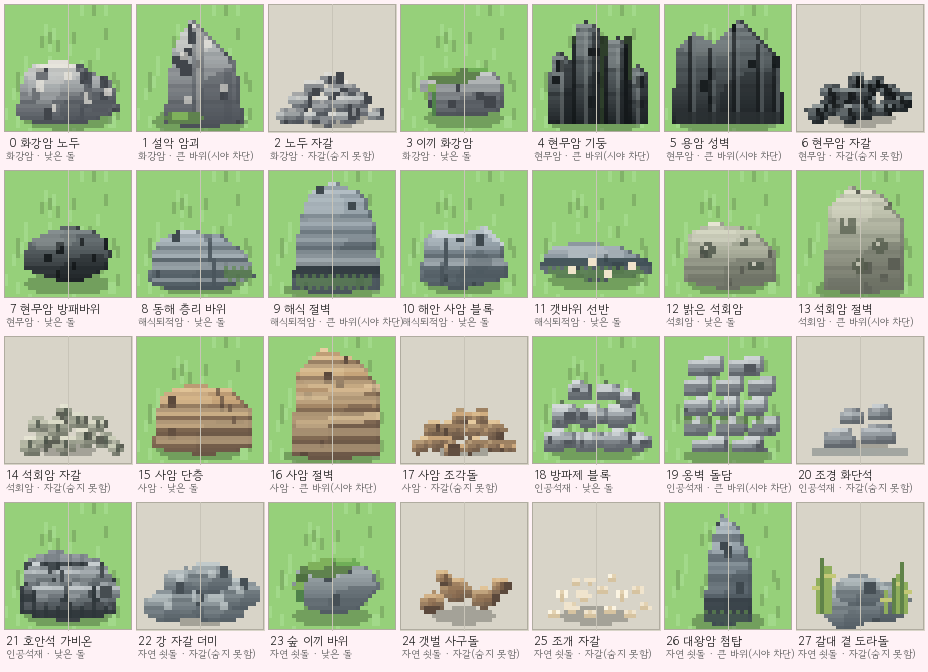
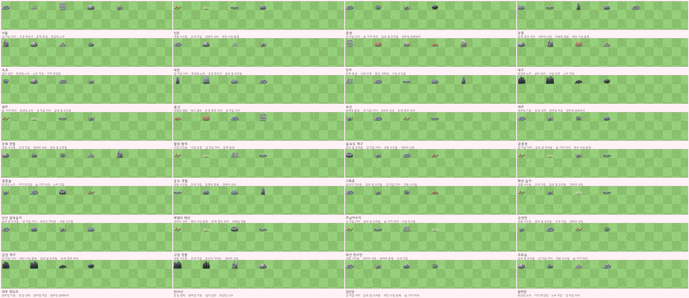
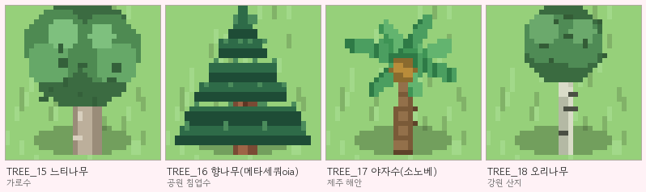

# 🏙 각 도시의 실제 지형 — 특색 있는 땅모양

> `Maps.kt`와 `RegionMapStyle.kt`가 이제 **12개 도시마다 전혀 다른 땅**을 만듭니다.  
> 같은 40×30 틀 안에서도 한눈에 “여긴 서울, 여긴 제주”가 보이도록 실제 지리를 압축해 넣었습니다.

## 설계 원칙

- **중앙 광장(17..25, 12..18) + 십자 간선(19,20 / 15,16)은 절대 건드리지 않는다** — 길과 NPC·집이 항상 같은 자리에서 연결되도록 `isPlazaOrRoad`로 보호.
- **건물 블록(6,3 / 31,3 / 6,24 / 31,24)과 우리 집(20..26, 8..12)도 보호** — 지형이 건물을 덮어 사라지는 일을 방지.
- **결정적 생성(Random 시드 = 지역 id)** — 같은 지역에 들어가면 항상 같은 지형.
- **색(팔레트)과 물길(강·호수), 지형(산·오름·섬·숲)을 세트로** — 눈·지도·실제 생태 정보가 일치.

---

## 12개 도시별 지형

| 도시 | 실제 지리 모티브 | 팔레트 | 물길 | 산·지형 |
|---|---|---|---|---|
| **서울** | 한강이 도심을 가르는 분지, 북한산·관악산·남산 | `seoulUrban` 차분한 Sage+슬레이트 Han강 | 한강 동→서 중앙( y 10~11, 폭 1.25) + 중랑천 지류 북동 합류 | 북한산(7,4 / 11,5) 북서 2봉, 남산(22,19) 도심 언덕, 아차산(33,7) 동쪽, 관악산(8,26 /12,27) 남서 대산괴, 북쪽 소나무벨트·남쪽 강남 구릉숲 |
| **인천** | 서해 갯벌·영종도 섬, 계양산 | `westTidal` 갯벌 beige + 탁한 물 | 서해 갯벌( depth 2/4) 그대로 + 갈대띠 | 갯벌 위 모래섬 3개 `islandInSea(4,9/5,18/3,26)` + 계양산(33,6) 동북봉, 동쪽 솔숲벨트 |
| **춘천** | 의암호·소양호 호반도시, 북한강 협곡 | `chuncheonLakes` 호수물빛 green | 의암호(9,21) + 북한강 줄기(27,4→9,20) 춘천 협곡 | 소양쪽 능선(32,6 /34,11) · 서쪽(5,7)·남쪽(6,26) 봉, 협곡 삼나무벨트 2개, 호수앞 구릉(14,22) |
| **강릉** | 동해 절벽·경포호 석호·태백 대관령 | `gangneungPine` 소나무 bluer | 경포호(30,21) + 남대천(8,6→30,21) 태백→동해 | 태백 능선 `ridgeLine` 서쪽 전체, 동해안 솔숲(34,37), 북쪽 솔숲(9,14), 경포호 옆 언덕 |
| **속초** | 설악산 암벽·청초호 석호 | `highland` alpine | 청초호(30,21)+설악 계곡물(8,5→30,21) | 설악 암벽 `ridgeLine` 서쪽 두껍게, 울산바위 봉(9,8 /10,15), 해안 솔숲 |
| **대전** | 갑천·유등천·대전천 Y자 합류 분지 | `daejeonValley` 계곡 연두 | 갑천 본류(36,5→8,24) + 유등천 지류(26,26→14,11) Y합류 | 계족산(34,7)·식장산(35,24)·서남(5,26) 3봉, 합류 둔치숲, 보문산(15,26) |
| **전주** | 전주천·한옥마을·만경평야 | `jeonjuHanok` 한옥 따뜻한 흙색 | 전주천(11,4→12,25) 서쪽 녹지 | 건지산(8,6)·동쪽(32,6)·모악산(7,26) 3봉, 북쪽 논·외곽 구릉숲, 북동 기와집 2채를 HOUSE 타일로 직접 배치 |
| **대구** | 팔공산·비슬산 분지, 신천+금호강 | `daeguBasin` 건조 warm yellow | 신천(13,3→14,26) + 금호강(33,6→14,12) 동합류 | 북능선(7,4→32,5)·남능선(7,26→33,26) 분지 둘러싸기, 영천 구릉(35,13), 분지안 바위 산재+사과밭숲 |
| **광주** | 무등산·광주천·영산강 | `freshwater` 연못 green | 광주천(12,4→14,26) 중앙 | 무등산 대산괴(33,8 /35,13 /31,16) 동쪽 3봉, 서쪽 평야숲·18,24 상류숲, 광주천 둔치 |
| **울산** | 태화강 십리대숲·가지산·대왕암 | `southCoast` 남해 | 태화강 S자(5,25→36,18) 동해로 | 가지산(7,6)·신불산(11,8)·남서(6,22) 산군, 동해 대왕암 방파제 바위띠(35,37), 대숲벨트(8,18) |
| **부산** | 낙동강 하구·금정산·장산·해운대 | `southCoast` 항만 | 낙동강 하구(11,3→20,28) + 온천천(28,3→28,24) 동쪽 도심 피함 | 금정산(10,5)·장산(33,8)·35,15 4봉, 남쪽 모래 25,26 방파제 바위, 동해 솔숲+하구 갈대섬 |
| **제주** | 한라산 방패화산·오름·곶자왈·현무암 | `jejuVolcanic` 화산 검은 현무암 stone | 호수 없음, 물길 없음 — 대신 분화구 지형 | 한라산 중앙(20,14/20,15) 대형 5·4rad, 오름 7개(12,7 /28,9 /30,16 /26,23 /10,23 /14,17 /33,21), 곶자왈 숲벨트 2개, 전역 현무암 자갈 9% + 남북 모래 주상절리 |

### 그 외 20개 탐조지
- `WETLAND`는 갈대 외 둔덕 풀벨트, `COAST`는 안쪽 솔숲, `MOUNTAIN`은 모서리 두 봉 추가로 단조로움 해제 — 도시만큼 과하지 않게.

---

## 지역 고유 자연물과 실루엣

색만 바꾸는 데서 그치지 않도록 **32개 전 지역**에 `NatureArtSet`을 연결했다.
바위·나무·풀꽃·갈대·잔디 무늬까지 지역마다 다른 실루엣 묶음을 고른다.

### 바위 28종 — 암종 7 · 크기 3



`PropLooks.ROCKS`가 아트 번호의 **단일 기준**이다(아트 순서와 1:1, 크래시 없음).
같은 묶음 안에서도 **암종(색·질감)** 과 **크기(자갈 / 낮은 돌 / 큰 바위)** 를 다르게 줬다.
한 칸짜리 바위를 등간격으로 놓으면 "붙여놓은 돌" 같아서, 크기가 다른 돌을 겹쳐 놓은
**노두(露頭)** 로 보이게 하는 게 핵심이다.

| 묶음 | 번호 | 바위 |
|---|---|---|
| **화강암** (설악·광릉·왕피) | 0–3 | 화강암 노두(각진 면 3개) · 설악 암괴(첨탑) · 노두 자갈(이끼·결정 반점) |
| **현무암** (제주·하도리·한라) | 4–7 | 현무암 기둥(서로 어긋난 기둥 무리) · 용암 성벽 · 현무암 자갈(기공 구멍) · 방패바위 |
| **해식퇴적암** (동해) | 8–11 | 동해 층리 바위 · 해식 절벽(파식 홈) · 해안 사암 블록 · 갯바위 선반(깃물) |
| **석회암** (전주·광주 서안) | 12–14 | 밝은 석회암(용식 구멍) · 석회암 절벽 · 석회암 자갈 |
| **사암** (철원 평야·대구 분지) | 15–17 | 사암 단층 · 사암 절벽(사교층리) · 사암 조각돌 |
| **인공석재** (항구·한옥·도시) | 18–21 | 방파제 블록(계기초) · 옹벽 돌담 · 조경 화단석 · 호안석 가비온(철망) |
| **자연 쇳돌** (강가·갯벌·숲) | 22–27 | 강 자갈 더미 · 숲 이끼 바위 · 갯벌 사구돌 · 조개 자갈 · 대왕암 첨탑 · 갈대 곁 도라돌 |

> **크기급이 게임 규칙이다** — `PropSize.PEBBLE`(발목 높이)은 시야를 가리지 않는다.
> 자갈 뒤에 서서 새를 노려도 새는 도망다. 숨어서 접근하려면 나무나 큰 바위를 찾아야 한다.
> (`Maps.kt occludesSight()` → `PropLooks.rockBlocksSight()`)

### 지역별 바위 — 32개 전 지역



`RegionMapStyle.natureArtFor()`가 도시 12곳과 명소 20곳의 바위 번호를 **직접** 지정한다.
묶음만으로는 한눈에 구분되지 않으므로, 같은 해안이라도 강릉(동해 층리·첨탑)과
인천(갯벌 사구돌)이 전혀 다른 돌무더기가 된다.

- **서울** 한강 자갈 · 도심 화단석 · 한복판 옹벽 &nbsp;/&nbsp; **인천·강화·송도·고창** 갯벌 사구돌·조개자갈
- **춘천·주남·임진·공릉** 물에 둥글게 닳은 자갈 · 도라돌 &nbsp;/&nbsp; **안산·시화·순천만·우포** 갈대 사이 도라돌·제방 가비온
- **속초·광릉·왕피** 설악의 화강암 첨탑 · 이끼 낀 바위 &nbsp;/&nbsp; **제주·하도리·한라** 현무암 기둥·용암 성벽
- **강릉·매향리** 갯바위 선반 · 동해 층리 &nbsp;/&nbsp; **울산** 대왕암 첨탑 &nbsp;/&nbsp; **부산·태안** 방파제 계기초 블록
- **전주** 한옥 돌담 · 서안 석회암 &nbsp;/&nbsp; **철원·대구** 논둑 사암 · 팔공산 암괴 &nbsp;/&nbsp; **광주** 무등산 이끼 바위

### 나무 19종 · 계절 갈아입기



기본 4종(참나무·소나무·벚나무·단풍) + 지역 수종 8종(버드나무·대숲·동백·곰솔·자작·은행·과수·전나무)
+ 겨울 전용 3종(앙상한 가지·눈 덮인 활엽수·눈 덮인 소나무) + **지역 수종 4종**으로 19종.
활엽수는 봄 벚꽃 → 여름 푸른 잎 → 가을 단풍/은행 → 겨울 앙상은 가지로 갈아입고,
상록수(소나무·대숲·곰솔·전나무·**향나무·야자수**)는 사계절 같은 실루엣을 유지한다.

- 느티나무(가로수·얼룩배기) · 향나무(공원 원뿔) · 야자수(제주 해안) · 오리나무(강원 산지) 4종을 추가했다.

### 바위 아트 키트 (`Assets.kt`)

모든 바위가 같은 조명 규칙(빛은 왼쪽 위)을 쓰도록 공용 도구 하나로 그린다.

- `rockBody()` — 실루엣을 채우고 행마다 윗빛→아랫그늘 디더 그라데이션, 좌상단 하이라이트, 우하단 그늘, 표면 알갱이, 우하단 어두운 테두리
- `lump()` — 시드로 결정되는 불규칙 타원 실루엣(각각 다른 바위를 뽑는다)
- `mossCap()` · `weedFringe()` · `crackIn()` — 이끼·깃물·균열 같은 지표 장식
- `propLook`/`rockLook` — 숨김 판정과 그림자가 함께 쓰는 변형 번호

- `Maps.kt`: 바위를 놓을 때 42% 확률로 **인접 칸에 동행 돌**을 하나 더 얹어(`rockBuddy()`) 돌무더기로 만든다. 길·광장·건물 예약 칸은 그대로 지킨다.
- 갈대·억새·꽃밭·잔디 무늬도 갯벌/호수/산림/들판에 맞춰 달라진다.

## 이번 지형 확장 — 낮은 땅과 올라가는 길

맵은 이제 평면 산책로만이 아니라 **높이 차가 있는 탐조 동선**을 만든다. 각 지역에 실제 모티브를 딴 전망 데크 하나가 생기고, 데크까지는 기존 길에 연결된 돌 경사로를 직접 걸어 올라간다.

- `GameMap.elevation`이 타일마다 상대 높이를 보관한다. `0`은 평지, 양수는 둔덕·전망 데크, 음수는 갯벌·갈대밭·물가 저지대다.
- 한 칸 이동 때 높이 차가 1을 넘으면 막힌다. 따라서 높은 곳으로 순간이동하지 않고, 한 단씩 이어진 경사로를 따라 올라가야 한다. 자전거도 같은 지형 판정을 사용한다.
- 전망 데크는 지역별 이름과 실루엣을 갖는다. 서울의 남산·한강, 춘천의 의암호, 속초의 설악 계곡, 울산의 태화강 대숲, 부산의 항구, 제주 오름 등 32개 지역에 각각 다른 목적지를 배치한다.
- 데크 가장자리에는 단차 그림자·난간·깃발을 그려, 아래에서 봐도 “저기로 올라갈 수 있겠다”는 목표가 보인다. 데크 위에서 A를 누르면 지역 풍경을 감상하고 행운 보너스를 받는다.
- 호수·강·갯벌·논·갈대밭은 낮은 테두리로 내려앉은 지형처럼 보인다. 기존의 강·호수·산·해안 팔레트와 자연물 프로필은 그대로 유지해 지역별 풍경 차이를 보존한다.

구현은 `RegionMapStyle.kt`의 `ViewpointSpec`, `Maps.kt`의 전망 데크·경사로 생성, `WorldScene.kt`의 높이 차 이동/감상 상호작용에 나뉘어 있다. 예전 세이브에는 높이 배열이 없으므로 자동으로 평지로 읽혀 기존 진행도와 충돌하지 않는다.

## 코드 위치

- **바위 카탈로그(단일 기준)** — `PropLooks.kt`
  `PropLooks.ROCKS` 28개가 아트 번호·이름·크기급(`PropSize`)·암종(`RockKind`)의 단일 기준이다. `Assets.kt`·`Maps.kt`·`RegionMapStyle.kt`는 전부 이 표를 참조한다.
- **팔레트·호수·강·자연물 프로필** — `RegionMapStyle.kt` `forRegion()`
  각 도시의 실제 경위도·진입로 방향을 존중해 `MapLake`·`MapRiver` 좌표를 손으로 찍음. (한강은 광장 1칸 북쪽 y=10/11, 낙동 하구는 광장 동쪽을 피해 x=27~28 등)
- **지형 배치** — `Maps.kt` `MapBuilder.build()` 3.5 단계  
  `hillCone() / ridgeLine() / islandInSea() / forestBelt()` 헬퍼로 산·섬·능선·숲을 찍고, `isPlazaOrRoad`로 광장·간선·건물·집을 보호. `structure / reserved / t / base`를 정확히 갱신해 충돌·길뚫기와 그림자에 반영.

## 시각적 효과

- 물·모래·풀·돌의 **곱하기 틴트(MULTIPLY)** 는 텍스처를 살리며 도시별 색을 바꾼다 — 서울은 도시 Sage, 대구는 분지 warm yellow, 제주는 화산 검회색.
- 강을 건너는 길은 자동 `Pave.STONE` 돌다리, 물가에는 출렁이는 `foamEdge` 포말과 반짝임이 남는다.
- 언덕 위 `T.MOUNTAIN`은 벌크(그림자 길게), `T.ROCK`은 프롭(아침에 긴 그림자), `T.TREE`는 가로수·솔숲으로 옅은 색 필터가 씌워진다.

## 확인

```bash
python3 tools/kt_check.py  # → 문제 파일 0개
python3 tools/preview/render_rocks.py docs/img/rock_catalog.png   # 바위 28종 + 지역 32곳 시트
python3 tools/preview/tree_art.py   docs/img/regional_trees.png   # 지역 수종 4종 시트
# 실제 폰에서: 서울→인천 서쪽 터널로 나가면 갯벌 섬 3개가 보이고,
# 서울 중앙에서 남산·관악산이, 제주 중앙에서 한라산+오름 7개가, 강릉 서쪽에 태백 능선이 보입니다.
```
